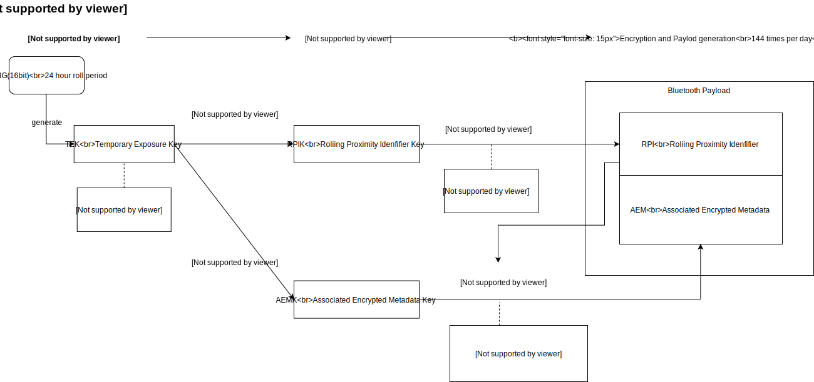

&leftarrow; [back to Homepage](../index.md)

# Contact Tracing - a System Design Exercise

Contact tracing is one of the possible ways to control the spread of an infectious disease, by notifying the people who have been in contact with a confirmed positive case, and asking them to self-quarantine. Governments and health authorities are conducting contact tracing using various methods, some involving manual processes others using an automated system based on smartphone apps. How would you design such an automated contact tracing system? Here I want to present to you upfront a possible architecture with one use case depicted. Don't worry about all the details now, as you go through the blog post hopefully all the pieces should fall into their place.

Also note that this is not purely a theoretical exercise, these systems already exist and are in production in some countries. At the time of writing this in January 2021, there are 8 countries from the European Union that use an official contact tracing app, inter-operating with each other, functioning beyond borders (Croatia, Denmark, Germany, Italy, Netherlands, Ireland, Latvia, Poland and Spain). Some of these systems even have open source implementations, for example the [Spanish RadarCovid](https://github.com/RadarCOVID).

Based on the latest data (27 December 2020) in Spain the app was downloaded by 6 million people (12% of the population), with around 25.000 positive cases declared through the app. This 25.000 only equals about 1.5% of the total positive cases reported since the initial release of the app 9th of September 2020 ([1.4 million cases](https://ourworldindata.org/coronavirus-data-explorer?zoomToSelection=true&time=2020-09-09..latest&country=~ESP&region=World&casesMetric=true&interval=total&hideControls=true&smoothing=0&pickerMetric=location&pickerSort=asc)).

The goal of this blog post is to describe how these contact tracing systems are built and how they work, applying some simplifications to favor understandability. The approach taken is to present this as a systems design exercise, divided into the following parts:
* [Scoping](#scoping)
* [High-level design](#high-level-design)
* [Design trade-offs](#design-trade-offs)
* [ENS - the basic building block](#ens---the-basic-building-block)

## Scoping

First, let's talk about some facts that are given and some assumptions that we presume. To be able to detect contact between users we need a distributed system where each user carries a device, which is part of the system. Given the following assumptions it is possible and worthwhile to build such a system:
- enough people carry smartphones to build a contact tracing system using smartphone apps
- close contact of smartphones is a good approximation of close contact of people
- smartphones are not shared between different individual generally (or only in a negligible percentage of cases)
- with time, enough people will use the app to make a difference or at least help out the authorities with contact tracing

Other assumptions about the disease that we can make: 
- infectious period of the disease is known or at least can be closely approximated - we can use 14 days in case of COVID-19 (as defined in the [Privacy Policy of a real app](https://radarcovid.gob.es/politica-de-privacidad))
- for the disease to spread, individuals have to be in close physical contact - for which we can use the definition of less than 2 meters for more than 15 minutes (as in the [Privacy Policy of a real app](https://radarcovid.gob.es/politica-de-privacidad))

This first assumption one is an important piece of information, as all data and events registered by the system can be deleted after 14 days, as they are no longer relevant. This puts limits on the storage space, network data transfer and computations needed and allows the system to scale nicely, as we don't need to keep infinite history. The following assumption will help us when doing the calculations for close contact events and exposure detection.

Next, let's roughly define the main use cases, and agree on the requirements of the system. These could be grouped in four separate categories.

**User proximity/close contact**
- detection
- storage (for a limited time period) in order to check for exposure

**Positive diagnostic cases**
- reporting - newly confirmed positive diagnosis of users can be added to the system
- storage of all previously reported positive cases (for a limited time period) in order to warn of exposure

**Exposure detection**
- check for user close contacts with a confirmed positive case in a given time period and calculate risk score
- based on risk score notify user of possible exposure to the disease and clear medical instructions

**Privacy**
- individual identity or location of app users cannot be extracted from the system

So based on all the scoping above let's try to come up with a simple design for such a system. 

## High-Level Design

There are some key technologies that we should be familiar with and make use of to build such a distributed system. 

Firstly, for detecting proximity of mobile devices we should use a wireless data transfer technology. The natural choice is **Bluetooth Low Energy (BLE)**, which is a short distance, low power consumption technology, ideal for small data transfers between devices. The reduced power consumption is important for mobile devices, and our requirements do not require the transfer of large amounts of data. Other technologies are less suitable for our use case; NFC has insufficient range (only about 10cm, while the airborne infectious disease can spread further than 1 meter), while WiFi is aimed more towards high data throughput and has higher power consumptions.

Based on Bluetooth Low Energy, we need to choose some form of location-based technology. Here a good choice would be to use **Bluetooth Beacon technology**, which was specifically designed to broadcast information to other, nearby Bluetooth-enabled devices. This is used (by placing small hardware transmitters) in specific points of interest to distribute messages, like traffic information at a bus stop or marketing messages in stores. This kind of broadcasting only allows for 1-way data transmission, the emitter Beacon does not expect nor accept any response from the receivers, and so a Beacon cannot be used to track users against their will. 

Mobile devices can act as a Bluetooth Beacons to periodically broadcast information, and can also periodically scan their surroundings to detect other Bluetooth Beacons broadcasting. The typical data packages broadcasted are a unique Beacon ID and other associated metadata like a web url. 

So as a first approach, we could create a mobile app, let's call it Virus Radar. This app would generate a random, universally unique ID (UUID) associated with the device (and the owner/user of the device), and start broadcasting that ID (with some metadata to specify that this should be used for contact tracing for a specific disease). The app would also scan and collect UUIDs from nearby devices and store them together with a timestamp and a receiver signal strength (for later calculation of exposure time and distance approximations). This takes care of the first requirement group.

The seconds requirement group, the handling of positive diagnostic cases, should be managed/updated centrally. This would avoid inconsistencies in the data and serve as a single source of truth. We could add a central service, which would accept requests to register a new positive diagnostic case. We could call this component the Positive Diagnosis Server or just Diagnosis Server. To simplify, we will assume that the registration of new positive cases is done voluntarily and is based on self-declaration of users after a confirmed test. (In the real implementations of the system, there is a Verification Server component, which can validate test results using associated QR codes given out by the Health Authorities). 

So whenever a user is confirmed positive for the virus, there will be an option in the app to register this with the Diagnosis Server. During registration we would store the UUID that corresponds to the user/device and the registration timestamp. We could also store a time interval, during which we consider that UUID infectious. If we are overly cautious, we could use a large 28 day time-window, considering 14 days before and after the registration.

The Positive Diagnosis Server could be queried by the mobile application periodically for all newly registered positive cases in a given time period (for example in the last day). These confirmed positive UUIDs than could be downloaded to the app for exposure detection.

Once we have access to both sets of information (close contacts and positive diagnostic cases in a given time period), exposure detection calculation becomes trivial, we just need to look for matching UUIDs in both sets, during the same interval. Once a match is found, given the timestamps and the received signal strength, the app can calculate a risk score, based on which a warning can be shown to the user with clear medical instructions to follow).

With this we have the big picture of how to build a contact tracing system. Now all that is left is to sort out the details.

## Design Trade-Offs

#### How often should the app broadcast its UUID?

Broadcasting, being a 1-way data transmission, is cheap from a resource perspective, so we should do it often. More so, because scanning devices need to detect the broadcasted signal during their scan. If we broadcast once every minute, scanning devices need to keep scanning for a whole minute to guarantee that they will detect a nearby signal. That would be really wasteful on the scanning side. The current recommended broadcasting interval for exposure notifications is around 200 milliseconds ([Exposure Notification - Bluetooth Specification](https://blog.google/documents/70/Exposure_Notification_-_Bluetooth_Specification_v1.2.2.pdf)).

#### How often should the app scan for nearby UUIDs?

For scanning we face the trade-off between high frequency/precision and resource usage. Scanning can consume significant resources, since in a public place there could potentially be hundreds of broadcasters to detect and register, so we should do it rarely. Our close contact definition states that we need to detect exposures longer than 15 minutes, so we could get away with scanning only once in 7.5 minutes for example. If we detect a signal in three consecutive scans, we have detected close contact. This approach can have a maximum measurement error of 7.5 minutes, meaning we can only guarantee detection of 22.5 minute exposures. But we could go for a very frequent scanning, every minute, guaranteeing the detection of any 16 minute exposure. It all comes down to the error interval that wwe are willing to accept, that we are comfortable with. The current recommended strategy for exposure notifications is opportunistic scanning (leveraging existing wakes and scan windows) and with minimum periodic sampling every 5 minutes ([Exposure Notification - Bluetooth Specification](https://blog.google/documents/70/Exposure_Notification_-_Bluetooth_Specification_v1.2.2.pdf)). Also, we should scan for an interval of at least 200ms to guarantee broadcast detection.

#### How long should the UUIDs be? How many bits?

Longer IDs have a smaller chance of collision, but take up more storage space and would require more network data transfer. In computer science using 128 bits for UUID is considered good enough (without any central coordination system the chance of ID collision/duplication is negligible). And in fact these 128 bit ids are used in real applications ([Exposure Notification - Cryptography Specification](https://blog.google/documents/69/Exposure_Notification_-_Cryptography_Specification_v1.2.1.pdf)).

However, it is interesting to do a thought experiment and try to argue for decreasing the number of bits used, assuming that some probability of collision is acceptable. 

To help with our calculations, we should estimate also the number of potential users of our system. If we consider the country of Spain and assume that 20% of the population would use the application, then we would expect to have about 10 million users. That means that we need to generate at least 10 million UUIDs.

To estimate the collision probability, we can use the generalized form of the birthday problem. The original birthday problem is concerned with calculating how many people are needed to have a 50% probability that at least two of them are born on the same day? The surprising answer is only 23. The generalized birthday problem, stated as a collision problem, is the following: how many integers (n) can we select from an uniformly distributed interval [1,d], with a probability (p) of at least one collision. There are two methods to estimate the value mentioned on [wikipedia](https://en.wikipedia.org/wiki/Birthday_problem#Cast_as_a_collision_problem).

The first one is more like a ballpark estimation, that says that the expected number of N-bit hashes that can be generated before getting a collision is 2^(N/2). So to make our calculations easier, let's say we want to generate 16 million UUIDs (~ 16*1024*1024 = 2^24), before getting a collision. For that we would need the double of 24, which is 48 bits. Compared to the original 128 bits, this would result in 62% (1-(48/128)) reduction in ID sizes, but comes with an increased probability of collisions. The other method lists a formula that helps us estimate the probability.

Let's use the above derived values of a 48 bit ID, and say that our interval ranges from 1 to 2^48 (= 2^8 * 2^40 ~ 256 * 10^12 = d). Now if we accept a probability of 1% for collision (p=0.01) and put these values into the formula we get the resulting number of 2.2 million. This means that we can select/generate 2 million IDs, using 48 bits, with a 1% chance of collision. 

If we accept a higher probability, 25% chance for collisions (p=0.25), we get a higher number 12 million. Meaning from 12 million IDs generated, using 48 bits, we have a 25% change that any two collide. Similarly, lower probabilities (0.01%, p=0.0001) will result in a lower number of IDs that can be generated without collision (~150.000=0.15 million).

So given all this, should we decrease the number of bits used for IDs, and settle on a higher acceptable level of collisions, that could lead to false positives for our contact tracing system? Probably not, and we should stick with using 128bit IDs, unless we can really trust our estimations and the ID size turns out to be a bottleneck for the system.

#### How often should the app query the Diagnosis Server? Would this scale?

This question has to be answered taking into account two perspectives. From the mobile apps point of view, querying too often would not be an efficient use of networking resources. From the server perspective serving too many clients too often might overload the service.

We also need some additional data. First we should have an estimate of potential users of the app, to be able to account for the server load when serving data to all the users. Let's go here with the previously proposed 10 million users here as well. Second we should have an estimate of how often and how many new positive cases are detected. So let's consider the country of Spain and a roughly one month period, when there was a surge in the number of cases, between October 15th - November 19th, 2020. In this period the confirmed cases of COIVD-19 increased by more than half million, [620.000](https://ourworldindata.org/grapher/covid-19-total-confirmed-cases-vs-total-tests-conducted?tab=chart&stackMode=absolute&time=2020-10-15..2020-11-19&country=~ESP&region=World). In these 35 days, there were on average 17.000 new cases daily - which is equivalent to 1 new case every 5 seconds on average (86.400 seconds in a day vs 17.000 new cases reported daily).

Given these numbers we can see that there will be an asymmetric traffic pattern, heavily skewed towards reads. If the app only queries the server once a day, then we have 10 million reads versus the daily maximum number of new cases added, which we can approximate as 20.000 writes. Also we might want to query more frequently than once a day, let's say roughly once every hour with randomized time intervals to spread the load. This would equal on average to 2800 read requests/second versus less than 1 write request/second.

To be able to serve these types of read-heavy request patterns, the database has to be read scalable. This is usually done by replicating the database, setting up several read replicas. There will be a primary node, which will accept read and write requests, and several secondary nodes which will only accept read requests. Every write request to the primary node will be replicated to all secondary nodes. These secondary nodes or read replicas can also serve as failover nodes, in case the primary node fails. The replication can be done synchronously, if write requests to the primary node only return successfully after at least some secondary nodes are updated as well. This results in an active-active architecture, where failover can happen immediately. Replication can also be asynchronous, if the writes to the primary node are decoupled from the updates happening to secondaries. This is called active-passive or primary-standby architecture, which offer lower latency writes in exchange for slower failovers.

The ability to serve the read request also depends on our exact query and the data model. Fortunately, for our use case we can have a simple data model and a simple query. We store confirmed positive UUIDs with a registration timestamp and an infectious time period. The data can be sorted based on the registration timestamp. Queries for newly registered UUIDs would just return all records with a registration timestamp greater than a given input timestamp.

We can also estimate the size of the data needed to be transferred. If we assume 1000 new cases registered per hour (~20.000 cases per day), then every hour we need to download 1000 records containing the UUID and the timestamp. The size of one data record would be a 128 bit (UUID) plus a 64 bit (timestamp), equalling to 192/8 = 24 bytes. So a raw, uncompressed data payload of 1000 records would be around 24 KB, which seems small enough to not be a bottleneck.

#### How does the system protect privacy?

As previously mentioned Bluetooth Beacon technology is a 1-way transmission, so a beacon cannot track the receivers of its signal. However, in the case of the contact tracing app, each device acts not only as a beacon (data emitter), but also as a data receiver. And whenever we are doing a scan with the app, we receive the BeaconID and this makes it possible to track specific beacons.

To avoid this, system designers came up with the clever idea not to use fixed BeaconIDs. Every 10 minutes we could generate a new ID (a new Bluetooth Beacon Ephemeral Identifier), making the tracking of any particular ID only possible for 10 minutes. Bluetooth MAC addresses can also rotate every 10 minutes to prevent location tracking by tying together observations of a fixed MAC address. This limits greatly the possibilities to track users.

One disadvantage that comes with this solution, is the increase in the amount of data that needs to be transferred between the app and the Diagnosis Server. As an example, instead of using the same UUID, we need to create a new one every 10 minutes. This means 144 different IDs per day, 6 different IDs every hour. In case of doing hourly queries to the central server, this means that we increase the payload size with one order of magnitude. Based on the previous calculation this would result in 240 KB payloads, which still seems to be of acceptable size, without causing any issues.

While trying to protect privacy as best as we can, we should note that no matter the design and algorithms chosen, perfect privacy cannot be guaranteed. As an example let's imagine a monk, who lives alone in a mountain top, only meeting one delivery person every two weeks, who supplies the monk with the necessary food and other things he might need. Now imagine that both the monk and the delivery guy uses the Virus Radar app, both have their bluetooth activated, and after a few days of meeting the delivery guy, the monk receives the exposure notification on his phone. He will know for sure that he got exposed to the virus through meeting the delivery guy, who has been confirmed to be infected. In this case, because of the circumstances of use, the app cannot protect the delivery guy's privacy. Some could argue that for users like the monk, who only met one person in the previous 14 days, the app should not reveal the possible exposure and protect the privacy of the delivery guy. However, what if the monk is planning to go next week to the annual monk meetup, and if he had not been notified of the possible exposure, he would spread the disease amongst all the monks in the country. Or what if the monk interacts with other people, who don't use the contact tracing app, and so should be notified to protect the non app users as well.

## ENS - the basic building block

Of course building all this from scratch would require a lot of effort. Fortunately, we could build upon a basic component called ENS. Google and Apple joined forces and together developed the Exposure Notification System (ENS), which is now available as part of the platform for the latest Android and iOS. The Exposure Notification System was created with the specific purpose to enable the creation of privacy respecting contact tracing apps on these platforms. Almost all critical parts are taken care of automatically by ENS: 
- it manages the creation and rotation of cryptographically random keys and derived Bluetooth identifiers
- it manages the Bluetooth and data transmission, Bluetooth Beacons, rotating MAC addresses and scanning for nearby devices
- it protects privacy, by not allowing direct access for the apps to scanned identifiers (more on this later)
- it can be integrated with a verification server, to only release IDs in case of a verified positive diagnosis
- it handles the matching of close contact and positively diagnosed IDs and does the exposure calculations

On Android the Exposure Notification System is accessed through Google Play Service. Based on what we have discussed so far, the following diagram should give you an idea, how do all the pieces fit together.

One interesting thing to examine is how the ID generation works. This is documented in the [Cryptographic specification](https://blog.google/documents/69/Exposure_Notification_-_Cryptography_Specification_v1.2.1.pdf), however it is worth going into the details a bit here and separating the encryption and decryption flows. 

The basic idea is generating a random key every day, then using that key to derive (through several steps) a new BeaconsIDs and bluetooth payload every 10 minutes. These BeaconIDs are used for close contact detection (transmitted and scanned). However when reporting a positive diagnostic case, we don't send the BeaconIDs, instead we send the original random generated keys to the server. These random keys can then later be used to re-derive the BeaconIDs and detect close contact events.

The encryption flow that takes place in ENS is the following. A cryptographic random number generator (CRNG) generates a Temporary Exposure Key (TEK) every 24 hours. This Temporary Exposure Key is then used to derive another key called Rolling Proximity Identified Key (RPIK). The key derivation is done using a hash-based key derivation function (HKDF). Once we have the derived key (RPIK), we use it to generate a new identifier every 10 minutes, which is called Rolling Proximity Identifier (RPI). This Rolling Proximity Identifier will serve as the BeaconID basically. The key generation step is done through encryption, using the AES symmetric key cipher. Symmetrics means that the same key (RPIK) can be used for encryption and decryption as well. The data that we encrypt to generate the final IDs, is the timestamp corresponding to the 10 minute interval, marking the creation of the new IDs.

The same process is repeated, starting from the Temporary Exposure Key (TEK), we derive another key called Associated Encrypted Metadata Key (AEMK). Using this key we generate the final part of the bluetooth payload called the Associated Encrypted Metadata (AEM). AEM is generated using symmetric encryption, but in [counter mode (AES-CTR)](https://cryptobook.nakov.com/symmetric-key-ciphers/cipher-block-modes). This mode of operation requires an initialization vector (IV), which should be like a random salt (we can use RPI for this purpose). Finally the data that we encrypt contains the protocol version and the transmit power, which can be used for proximity calculation based on receiver signal strength.

Now I have to be honest, I don't really understand the reason behind the key derivation step, as the original random key (TEK) could just be used instead of deriving a new key (RPIK). The key derivation step could serve various purposes. It could be needed to improve the random number generators output (which could be potentially biased). It could also serve to protect against analysis and attacks of the system. With every PRIK we generate 144 PRIs every day (one every 10 minutes), so in theory these IDs could be used to try to guess the original encryption key (RPIK). But knowing the derived key (RPIK) is not enough to exploit the system, as we would need access to the original Temporary Exposure Key (TEK) for that.

The important thing to note here is that the generated BeaconIDs (RPIs) never have to leave the Exposure Notification System. The mobile apps cannot access them, and they are not sent to the Diagnosis Server either. The only keys that are accessed by the app and are sent to the Diagnosis Server are the original Temporary Exposure Keys (TEK) and their creation timestamp (corresponding to a 10 minute interval number). These keys (TEKs) and their timestamp provide enough information to the Exposure Notification System to derive BeaconIDs, decrypt information and do the calculation to detect possible exposure. 

Let's examine the decryption flow in more details. Once the Diagnosis Server is queried, we receive a set of Temporary Exposure Key (TEK) and corresponding timestamps. Using the key derivation function (HKDF) we can re-derive the Rolling Proximity Identifier Keys (RPIK) and Associated Encrypted Metadata Keys (AEMKs). Then for each of the PRIKs we re-create the 144 Rolling Proximity Identifiers (RPI), knowing that their broadcast time is every 10 minute interval of the day (and the day is known from the Temporary Exposure Keys timestamp). Now these recreated RPIs can be compared to the ones that were scanned and stored in the last 14 days. If there is a match of IDs with an overlap of scan time and broadcast time (using a tolerance window) we have detected a possible exposure. For each match we can calculate the exposure duration based on timestamps. Using the corresponding AEMK we can also decrypt the metadata and access the original transmit power data. This can be compared to the stored receiver signal strength to give estimations for the proximity of the contact. Based on the duration and proximity of the exposure a risk score can be calculated. The Exposure Notification System can provide daily summary of pre-calculated risk score, or surface the exposure data to the app to allow for flexible risk score calculations. Based on the risk score the users can be notified with clear medical instructions.

And that is how ENS provides all the basic building blocks to be able to create a contact tracing system.

#### References

* https://github.com/RadarCOVID
* https://ourworldindata.org/coronavirus-data-explorer
* https://radarcovid.gob.es/politica-de-privacidad
* https://blog.google/documents/70/Exposure_Notification_-_Bluetooth_Specification_v1.2.2.pdf
* https://blog.google/documents/69/Exposure_Notification_-_Cryptography_Specification_v1.2.1.pdf
* https://en.wikipedia.org/wiki/Birthday_problem#Cast_as_a_collision_problem
* https://cryptobook.nakov.com/symmetric-key-ciphers/cipher-block-modes
