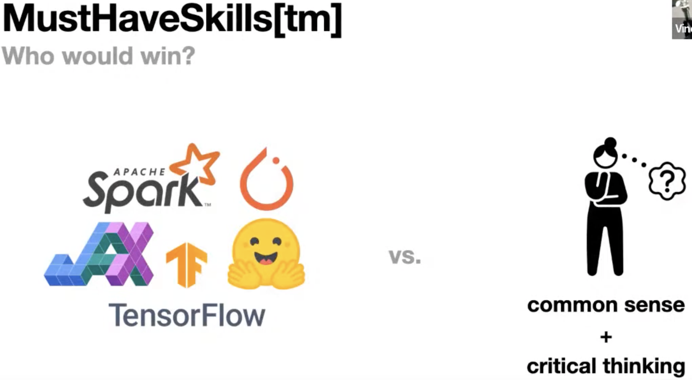
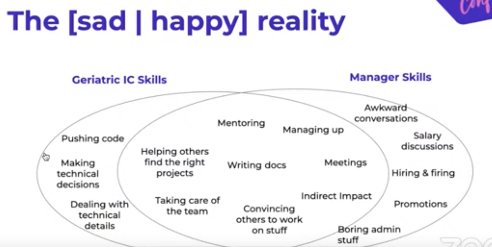

&leftarrow; [back to Homepage](../index.md)

# Nuggets of Wisdom from NormConf 2022

* [Vicki Boykis - Keynote/Main idea](#vicki-boykis---keynote)
* [Vincent Warmerdam - Keep calm and think critically]([#vincent-warmerdam---group-by-statements-that-save-the-day))
* [Luca Belli - The great overlap between senior engineers and managers]([#luca-belli---geriatric-data-science---life-after-senior))
* [Joel Grus - What's the simplest possible thing that might work, and why didn't you try that first?](#joel-grus---whats-the-simplest-possible-thing-that-might-work-and-why-didnt-you-try-that-first)

A week ago I've attended [NormConf - The Normcore Tech Conference](https://normconf.com/) - and I've truly enjoyed it. In fact, I've enjoyed it so much, that I've decided to write a blog post about it, in order to summraize some learnings, but also to promote the conference. The idea behind NormConf is simple: let's highlight the mundane, unsexy, normcore, day-to-day stuff that is actaully done by data scientist and machine learning engineers. So instead of talking about how our awesome recommendation engine uses the latest and greatest algorithms, let's talk about how did we actually solve our Python dependency issues.

This idea is really powerful, it frees you from the necessity to show off, to brag about your system, and gives space to talk about basic engineering struggles. Thinking about it in a philosophycal way, I could say that this allows the speakers to show vulnerability in a technical sense, humanizing them, bringing them close to the audience, we have all been there. It's a fresh take on tech conferences, and in my opinion a very welcomed one.

While the conference is mainly targetting data and ml people, most of the learnings can be applied to wide range of jobs, so don't be discouraged by that. I've got to say big kudos to the whole organizing team and to the speakers, who come off as really kind people and great educators. All images and ideas are taken directly form the conference, with the original author mentioned and linked. So with that let's dive in.

## Vicki Boykis - Keynote

As the mastermind behind the whole conference, Vicki's keynote talk perfectly sums up its main ideas. In the data science and machine learning space - the advertised map (of what we do at work) is not the true territory. The interviews and medium articles do not encompass most of what is done on a day-to-day basis, like creating dictionaries and adding things to lists. Building machine learning systems is just building software, engineering work, and it's fragile, and lot's of things can break, and it's not glamorous. Solid fundamentals, which seem boring, actually build to advanced work, so we should not be discouraged.

- [Vicki Boykis - NormConf Keynote talk](https://youtu.be/pR3QUegElmA?t=556)
- [Vicki Boykis - tech blog](https://vickiboykis.com/)

## Vincent Warmerdam - Group-by statements that save the day

This talk leaves you with a great sense of calmness. Today there are lot's of headlines and course marketing materials promoting must have skills for data scientist. But, Vincent argues, we should not worry about these too much. The real must have skills are common sense and critical thinking. Of course tools can be super useful, but there is too much empahsis on learning technical tools, which are just tricks to help us get through the day. Keep the calm in mind, stop bragging about the tools and start sharing anecdotes.

- [Vincent Warmerdam - NormConf talk ](https://youtu.be/pR3QUegElmA?t=2187)
- [Vincent is the creator of - CalmCode blog](https://calmcode.io/)

## Luca Belli - Geriatric data science - life after senior

Luca talks about senior leadership roles. One popular myth is that senior manager roles are very different from senior engineer, individual contributor roles (IC roles). People who pursue the IC career ladder, tell themselves that they don't like meeting, they want to work with computer, not people, they want spend time coding, and that the hard parts of each project is the technical work. These statements turn out to be mostly false. There is lot's of overlap in the necessary skills, and any sufficiently advanced engineer is indistinguishable from managment.

- [Luca Belli - NormConf talk](https://youtu.be/pR3QUegElmA?t=11217)

## Joel Grus - What's the simplest possible thing that might work, and why didn't you try that first

Joel is the author of some fantastic books (like [Data Science from Scratch](https://joelgrus.com/2019/05/13/data-science-from-scratch-second-edition/)), and just the title of his talk is a fantastic advice. It's a powerful argument and you can't really argue with it, you should always try the simplest approach first. However he argues, the simplest solution it's not always the least complex one. Instead it could just be the simplest one to use. Complexity can be abstracted away in smart ways, tools can be created that allow you to use complex machinery in a simple way. As an example, when doing text classifications low complexity models like logistic regression or naive bayes seem the simplest. However with huggingface libraries you can use pretrained language models with just a few lines of code, and get a significantly better results, and so you should use this approach.

- [Joel Grus - NormConf talk](https://youtu.be/pR3QUegElmA?t=16892)
- [Joel Grus - tech blog](https://joelgrus.com/)

