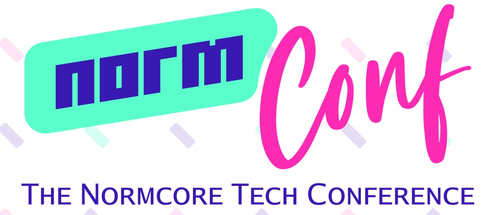
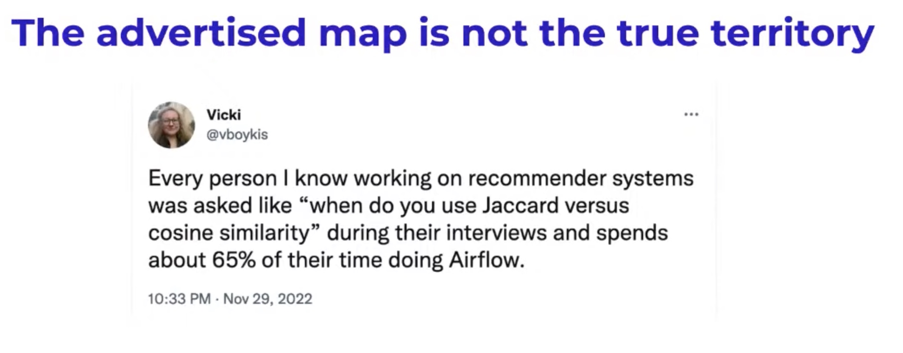
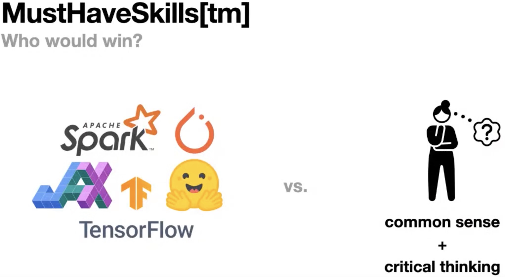
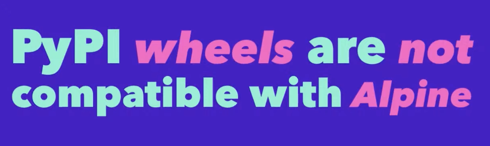
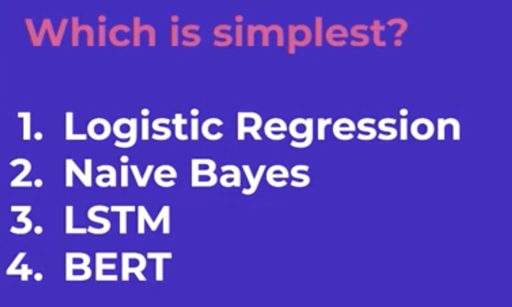
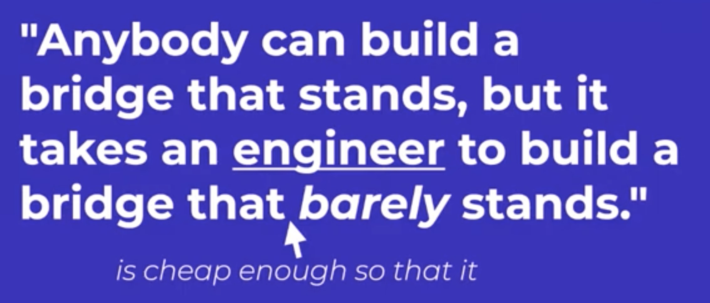
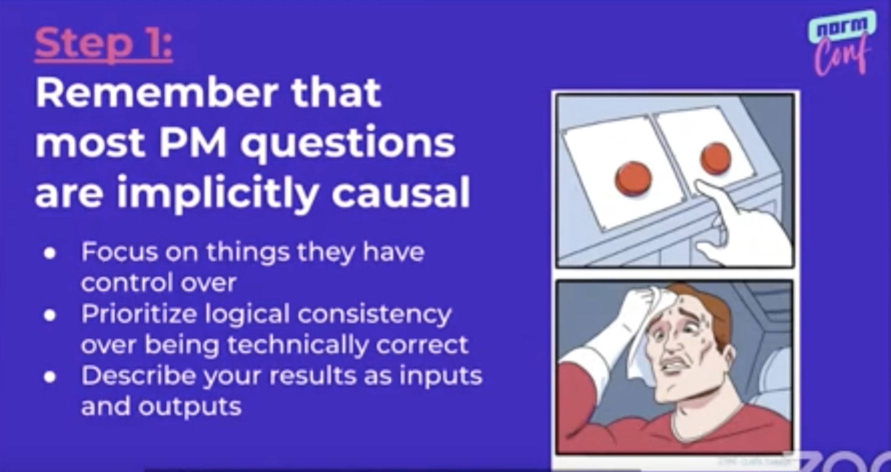
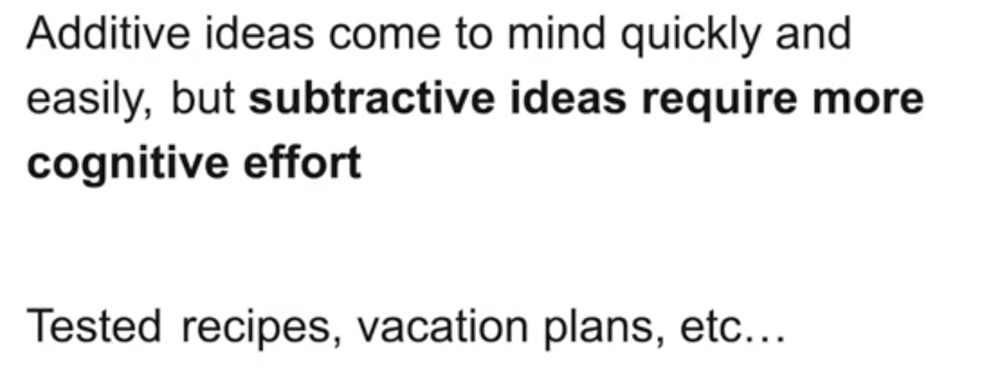

&leftarrow; [back to Homepage](../index.md)

# Nuggets of Wisdom - from NormConf 2022

* [Vicki Boykis - Most ML work is not glamorous](#vicki-boykis---keynote)
* [Vincent Warmerdam - Must have skills are fake news](#vincent-warmerdam---group-by-statements-that-save-the-day)
* [Matthijs Brouns - Small Docker and Python Wheels](#matthijs-brouns---how-small-can-i-get-that-docker-container)
* [Luca Belli - The great overlap between senior engineers and managers](#luca-belli---geriatric-data-science-life-after-senior)
* [Joel Grus - What's the simplest possible thing that might work, and why didn't you try that first?](#joel-grus---whats-the-simplest-possible-thing-that-might-work-and-why-didnt-you-try-that-first)
* [Peter Sobot - Thinkg about costs of engineering and ML](#peter-sobot---its-all-about-cost-how-to-think-about-machine-learning-products)
* [Katie Bauer - Translate PM speak](#katie-bauer---how-to-translate-to-pm-speak-and-back)
* [Jamed David Long - Substractive thinking](#james-david-long---id-have-written-a-shorter-solution-but-i-didnt-have-the-time)

A week ago I attended [NormConf - The Normcore Tech Conference](https://normconf.com/) - and I truly enjoyed it. In fact, I've enjoyed it so much, that I've decided to write a blog post about it, in order to summarize some learnings, but also to promote the conference. All talks mentioned here are short (20 minutes) and punchy and make for a great listen in my opinion.

The whole idea behind NormConf is simple: let's highlight the mundane, unsexy, normcore, day-to-day stuff that is actually done by data scientists and machine learning engineers. So instead of talking about how our awesome recommendation engine uses the latest and greatest algorithms, let's talk about how did we actually solve our Python dependency issues.

This idea is really powerful, it frees you from the necessity to show off, to brag about your system, and gives space to talk about basic engineering struggles. Thinking about it in a philosophical way, I could say that this allows the speakers to show vulnerability in a technical sense, humanizing them, bringing them close to the audience, we have all been there. It's a fresh take on tech conferences, and in my opinion a very welcomed one.

While the conference is mainly targeting data and ml people, most of the learnings can be applied to a wide range of jobs, so don't be discouraged by that. I've got to say big kudos to the whole organizing team and to the speakers, who come off as really kind people and great educators. All images and ideas are taken directly form the conference, with the original author mentioned and linked. So with that let's dive in.

## Vicki Boykis - Keynote

- [Vicki Boykis - NormConf talk](https://youtu.be/pR3QUegElmA?t=556)
- [Vicki Boykis - tech blog](https://vickiboykis.com/)

As the mastermind behind the whole conference, Vicki's keynote talk perfectly sums up its main ideas. In the data science and machine learning space - the advertised map (of what we do at work) is not the true territory. The interviews and medium articles do not encompass most of what is done on a day-to-day basis, like creating dictionaries and adding things to lists. Building machine learning systems is just building software, engineering work, and it's fragile, and lot's of things can break, and it's not glamorous. Solid fundamentals, which seem boring, actually build to advanced work, so we should not be discouraged.

## Vincent Warmerdam - Group-by statements that save the day

- [Vincent Warmerdam - NormConf talk](https://youtu.be/pR3QUegElmA?t=2187)
- [Vincent is the creator of - CalmCode blog](https://calmcode.io/)

This talk leaves you with a great sense of calmness. Today there are lot's of headlines and course marketing materials promoting must have skills for data scientists. But, Vincent argues, we should not worry about these too much. The real must have skills are common sense and critical thinking. Of course tools can be super useful, but there is too much emphasis on learning technical tools, which are just tricks to help us get through the day. Keep the calm in mind, stop bragging about the tools and start sharing anecdotes.

## Matthijs Brouns - How small can I get that Docker container?

- [Matthijs Brouns - NormConf talk](https://youtu.be/pR3QUegElmA?t=7645)

Matthijs shared tricks on making Docker images smaller, like using dockerignore, small base image, few layers and multi-stage builds to remove build-time dependencies. However, for me the most important part of the talk is the explanation of Python Wheels and why don't they don't work on Alpine Linux OS. Wheels are the reason that downloading and installing most Python packages just works nowadays. Wheels are a binary distribution format, which means that they contain all external C code dependencies pre-built for your OS. This contrasts with source distribution formats (tar.gz), where you need to compile the C dependencies on your machine, when you install the package. Wheels are based on a standard (called standard manylinux), a subset of kernel and user space APIs that is assumed to work on many different types of linux distributions (debian, ubuntu, etc). However, because Alpine wants to be so small, it does not conform to this standard and uses a slightly different set of base packages, leaving you no choice but to compile C code dependencies. This often does not make sense, because it's a lot of time investment and complicates building your images.

## Luca Belli - Geriatric data science: life after senior

- [Luca Belli - NormConf talk](https://youtu.be/pR3QUegElmA?t=11217)

Luca talks about senior leadership roles. One popular myth is that senior manager roles are very different from senior engineer, individual contributor roles (IC roles). People who pursue the IC career ladder, tell themselves that they don't like meetings, they want to work with computers, not people, they want to spend time coding, and that the hard parts of each project is the technical work. These statements turn out to be mostly false. There is lot's of overlap in the necessary skills, and any sufficiently advanced engineer is indistinguishable from management.

## Joel Grus - What's the simplest possible thing that might work, and why didn't you try that first

- [Joel Grus - NormConf talk](https://youtu.be/pR3QUegElmA?t=16892)
- [Joel Grus - tech blog](https://joelgrus.com/)

Joel is the author of some fantastic books (like [Data Science from Scratch](https://joelgrus.com/2019/05/13/data-science-from-scratch-second-edition/)), and just the title of his talk is a fantastic advice. It's a powerful argument and you can't really argue with it, you should always try the simplest approach first. However he argues, the simplest solution it's not always the least complex one. Instead it could just be the simplest one to use. Complexity can be abstracted away in smart ways, tools can be created that allow you to use complex machinery in a simple way. As an example, when doing text classifications low complexity models like logistic regression or naive bayes seem the simplest. However with huggingface libraries you can use pretrained language models with just a few lines of code, and get a significantly better results, and so you should use this approach.

## Peter Sobot - It's all about cost: how to think about machine learning products

- [Peter Sobot - NormConf talk](https://youtu.be/pR3QUegElmA?t=18388)

As engineers, we should strive to build the best thing given the constraints (like Time and Cost). Machine learning solutions are costly, so we should only use them in specific places where we benefit from it the most, and use them in an economical way. An inventive way to minimize costs is to use a cheap, inaccurate ML model to pre-filter our data, before applying the expensive heavy ML model.

## Katie Bauer - How to translate to PM speak and back

- [Katie Bauer - NormConf talk](https://youtu.be/pR3QUegElmA?t=29146)

Often there is a misunderstanding between engineers and product people (PMs - Product Managers). Why is this the case? One common pattern is that engineers give very technical answers, overwhelming with the level of details, when actually what product managers are interested in are simple high level summaries, and explanations of the levers that can be pulled to change outcomes. A helpful advice is to assume good intent. People you work with are on the same team as you, and even though they might think and work in a different way, they are trying to do the right thing. Also consider incentives to be able to communicate better.

## James David Long - I'd have written a shorter solution but I didn't have the time

- [James David Long - NormConf talk](https://youtu.be/DYz5dMmtO6o?t=12655)

By default our brains are thinking in additive ways. Subtractive thinking is hard and people don't tend to do it, but there is great benefit in it. The whole concept of Minimum Viable Product is an exercise to trick you brain into subtractive thinking, figuring out what's the least we can do, to make the most positive value. Another great example is, when you are facing a bug, try creating a minimum reproducible example, because removing all the noise usually leads to the answer or makes it easier for someone else to find thea answer. This is a reductive exercise and it's a critical meta skill.
