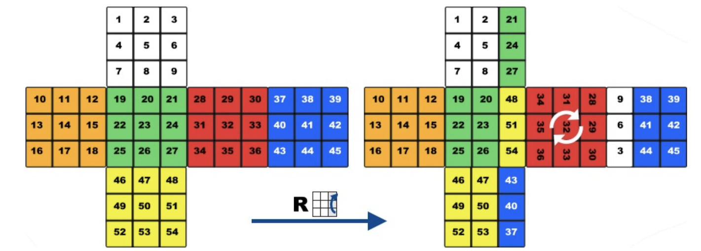
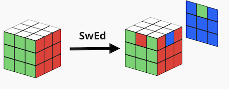

&leftarrow; [back to Homepage](../index.md)

# Taming the Rubik's Cube - or How I met Group Theory

* [Intro](#how-the-rubiks-cube-made-the-world-a-better-place)
* [Cubing basics](#cubing-basics)
* [Group Theory](#hello-group-theory)
* [Commutators](#commutators---a-cubers-best-friends)
* [Conjugates](#conjugates---a-cubers-second-best-friends)

## How the Rubik's Cube made the world a better place

Recently I've read the book [Cubed, written by Erno Rubik](https://semmi88.github.io/book_reviews/cubed.html) (the inventor of the cube), and this book rekindled my love for the Cube. The book details the process of invention and searches for reasons to explain its popularity. The argument put forth, with which I agree, is that it is not a coincidence that the Rubik's Cube became widely known around the world. There is something universal, almost magical about it, and it is full of contrast and contradictions: simplicity vs complexity, pleasure vs frustration.

The game itself is easy to understand, intuitive - there is no need for an instruction manual. A child and an adult can both understand the mechanics and the goal within 3 seconds of holding the cube and playing with it. Nevertheless it is a challenging puzzle, even just after a couple of rotations our minds cannot follow the patterns and we can get lost, unable to find our way back to the unscrambled state. It is frustrating, because the difficulty of the puzzle is not evident from its simple, aesthetically pleasing appearance. The cube evokes emotions, as it is not what we expect. And we, as humans, are naturally curious and drawn to these types of challenges, we want to be able to understand its mysteries and be able to tame the puzzle.

No wonder that the Rubik's Cube became a cultural symbol, a symbol of intelligence and problem solving. It brought on a revolution in edutainment (education + entertainment) by offering fun ways to introduce mathematical concepts to kids. And in the process it made studying, thinking about problems cool again. I could even go as far as to say, that the Rubik's Cube gave us a universal value system on which we can all agree. As somehow, deep down, we can all agree that solving a scrambled cube is a good thing, being able to understand and solve complex puzzles is a useful skill in life, and it is worth investing time to learn these skills.

## Cubing Basics

So how can you solve the cube? There are several well documented strategies, like the [layer-by-layer approach](https://ruwix.com/the-rubiks-cube/how-to-solve-the-rubiks-cube-beginners-method/), where you focus on completing each layer at a time by orienting and permuting the cubies. In total you need to learn about 5 algorithms, and with practice you will be able to solve the cube in around 2 minutes. That is pretty cool!  

Of course there are better, more advanced solving methods, but these require you to memorize more algorithms. Speedcubers, people who compete in cube solving world championships, learn about 200 different algorithms, which they can apply to different states of the cube, and so are able to solve a scrambled cube in under 10 seconds. Now that is impressive!

- But where do these solving methods come from? 
- Why do they work, what is the trick behind them? 
- And how could you come up with a solving method? 

*These are the questions that I will try to explore in this article*

A first intuition about creating your own solving methods consist in the observation that every rotation can be undone. Meaning that if we know exactly the rotations that scrambled the cube, then the puzzle becomes trivial. We can just do those moves in reverse and we get back to the original state. This is a key observation, although on its own it is not very helpful (as we usually don't know the rotations that scrambled the cube in the first place).

The difficult thing about solving the cube is that rotating any face moves a lot of pieces around, and it is hard to follow and keep up with all the changes. Ideally it would be nice to come up with algorithms that only affect a small part of the cube, only a small subset, like rotating two corners and leaving the rest of the cube unchanged. The good news is that using intuition and a bit of mathematics, we can come up with such algorithms. To be able to describe and discuss these algorithms, let's go over some cubing basics.

The Rubik's cube is made up of 26 tiny cubes (or cubelets), which can be grouped in three categories:
 - 6 center pieces, which have one colored face
 - 12 edge pieces which have two different colored faces (or facelets)
 - 8 corner pieces, which have three different colored faces (or facelets)

Solving methods usually are described using the [Standard Cube Notation](https://ruwix.com/the-rubiks-cube/notation/), which assigns a single capital letter to face rotations. 
 - 90° clockwise rotation of the 6 faces: F=Front, B=Back, R=Right, L=Left, U=Up, D=Down
 - 90° rotation of middle layers: E=Equator (between Up-Down), M=Middle (between Left-Right), S=Standing (between Front-Back)
   - these are only listed for convenience, as they could be achieved by combining rotation of the faces as well
 - Counterclockwise rotations of 90° are described by adding an apostrophe: F' is the opposite (or inverse operation) of F
 - Multiple rotations are described by adding a number after the letter: FFF = F3
   - Turning a face 4 times leaves the cube unchanged (identity operation), so: F4=1
   - Three turns in one direction equal a turn in the opposite direction: F3=F' (3 x 90 clockwise = 1 x 90 counterclockwise turn)

## Hello Group Theory

The cube is a highly symmetric twisty puzzle. It can be studied using Group Theory, which is an abstract branch of mathematics that studies patterns and symmetries. To be more specific, the cube can be described as the mathematical structure called a permutation group. 

A permutation group is an ordered list of numbers, on which we define permutation operations. These operations can rearrange the numbers, in a certain ways, and also meet the four primary properties of a group (have Identity Operation, have Inverse Operations, are Associative, exhibit Closure). 

The cube has 6 different colored faces and each color is repeated exactly 9 times, so it can be considered an ordered list of 54 numbers. Rotating a face of the cube then just rearranges the ordered list in a certain way (it's a permutation operation). Repeating and combining these permutations we can define new permutations, which rearrange the list in new ways. This way we can transform the problem of solving the cube, into studying permutations on lists of numbers.

### Non-commutativity makes the puzzle hard

An important thing to notice is that the face twists (these permutation operations) are non commutative. This just means that the order of operations matters, and changing the order might give us a different result. (This is also called non-abelian, after the mathematician Niels Henrik Abel).
 - this is different than multiplication, which is commutative, where reversing the order doesn't change the result 10 x 2 = 2 x 10
 - it is more like division, where  10 / 2 ≠ 2 / 10

To see this non commutative property of cube rotations in action, let's just do the following sequence of moves - `R B` (right face rotation, followed by a back face rotation) - and check the end state of the cube. Let's compare this to the end state we get if we apply the operations in reverse order - `B R` (back face, then right face rotation). As we can see, the order matter, as we end up with different end configurations for the two cases: `R B` ≠ `B R`

**If you don't own a Rubik's cube, but want to follow along, just use this [neat online cube solver](https://rubiks-cube-solver.com/)**

And in fact this non-commutative property is what makes the puzzle hard, because we need to apply the rotations in a careful order. If twisting the cube faces would be commutative, then solving the cube would be trivial. To see this, let's take a simplified version of the puzzle, where we can only turn the front (F) and back (B) faces (all other rotations are not allowed). In this specific case, we have commutative operations, because the front and back faces don't intersect (the facelets that they are permuting are independent of each other), and so the order of twists does not matter. (A fancy way of saying this in mathematics is that “disjoint permutations” commute).

No matter how much someone scrambles the cube with these two operations, the solution will be trivial. We know that making 4 turns of any face gets us back to the initial starting position. So if the front and back faces are not in the initial starting position, we just need to turn them 1,2 or 3 times (depending on the setup) and the cube is solved. So we can conclude that commutativity is boring, when it comes to cubing.

As a side note, computer solving algorithms (like the Thistlethwaite algorithm), use principles from group theory and similar subgroups (with restricted set of moves) to reduce the complexity of solving the cube and guarantee a worst case scenario of 45 moves to solve any scrambled cube.

## Commutators - a cubers best friends

As we saw before, some operations on the cube are non-commutative (right-back turns, `R B` ≠ `B R`), while others are commutative (front-back turns `F B` = `B F`). So what determines commutativity? How can we define it or measure it? And why should we care about it?

In mathematics we measure how commutative two operations are using a commutator. The idea is to apply the two operations and their inverses one after the other and check the result. For example given X and Y operations, the commutator would be calculated as the sequence `X Y X' Y'`.

If the operations are commutative, the order can be exchanged (`X Y X' Y' = X X' Y Y'`), and operations and their inverses will cancel each other out, and we get "zero" or Identity Operation as a result (which means that the state is left unchanged). However for non-commutative operations, the result of the commutator will be different from "zero" and will reflect the level commutativity. Almost commutative operations will have a "simple" commutator, and operations which are far from commuting will have a "complex" commutator. So in a way commutator shows how many elements were "co-mutated" by applying both operations and their inverses.

Coming back to cube solving, we want to find algorithms which modify only a few parts of the cube, and leave the rest unchanged. We can achieve this goal by finding two operations which almost commute. Applying the commutator of these operations will affect only a few cubelets, as most of the changes will be canceled out.

And how can we find operations which almost commute? As a rule of thumb we can say that permutation operations "almost commute" if they only affect a few elements in common. (This is not generally true, but a good enough assumption for our use case). To really understand all this, let's look at two examples.

**And again, if you don't own a Rubik's cube, but want to follow along, just use this [neat online cube solver](https://rubiks-cube-solver.com/), which can also execute algorithms specified with the standard cube notation**

### RoCo

Say that we want to come up with the algorithm that rotates corners on the top layer, meaning that it will not move them, just change their orientation. Let's call this algorithm Roco (from Rotates Corners - and in this case specifically upper-right corners). Here is the strategy that we can apply:

 - **Step1** We find a sequence of useful moves (let's call it X) - twists that leave the top layer unchanged, except for the one useful change that we are interested in: a single edge cubelet rotated. This is easier than it sounds, because even though we have to be careful with the top layer, our operation can arbitrarily mess up the bottom layer. So after some tries, we could come up with the following sequence of 6 moves: ` R' D R F D F' `

 - **Step2** After this we do a simple auxiliary/helper move (let's call it Y) - which barely intersects with our sequence of useful moves (X). This could just be twisting the upper layer, so our rotated corner cubelet is replaced by another corner cubelet, and we do not touch the bottom layer. The intersection of the two moves (X and Y) then is just in the top layer, meaning that everything which is messed up in the bottom layer, will be reversed by the commutator: `U`

- **Step3** Do the inverse of the useful moves in Step1 (X') - this will undo all the mess in the bottom layer, and also rotate the new corner cubelet in the opposite direction: ` F D' F' R' D' R  `

- **Step4** Do the inverse of the auxiliary/helper move in step2 (Y')- this just gets the flipped corners back to their initial position: `U'`

If you look carefully, with these 4 steps we executed the commutator `X Y X' Y'` of two operations. And because these operations almost commute, we undo most of the changes to the cube, except the ones involving common elements of X and Y in the top layer - the rotated corners. And that is exactly what we wanted! 

This formula can be applied to generate all sorts of algorithms that modify only a few parts of the cube. And it is fairly simple, the only creative part is to come up with the first sequence of operations (the useful moves), which make a slight change in the top layer.

### SwEd

Another example would be swapping edge cubelets, moving three of the edges in the upper layer (permute them in a cycle), without changing their orientation. Let's call this algorithm SwEd (from Swapping Edges - and in this case specifically upper layer, front-right-back edges).

 - **Step1** The useful moves (let's call it X) - in this case is swapping a pair of edge cubelets in the top layer (edge1 swapped with edge2). Again, here we don't care about messing up the bottom layer. A possible sequence would be applying the following 7 twists: ` M S D S' D' D' M' `

 - **Step2** We apply a similar auxiliary/helper move (let's call it Y) as before, just twisting the upper layer, so our pair of swapped edges are replaced by another pair: `U`

 - **Step3** Do the inverse of the useful moves in step1 (X') - this will undo all the mess in the bottom layer, and will also swap the new pair of edge cubelets (edge1 swapped with edge3): ` M D D S D' S' M' `

 - **Step4** Do the inverse of the auxiliary/helper move in step2 (Y')- this just gets the upper layer back to it's initial position
`U'`

Similarly as before, in these 4 steps, we applied the commutator ` X Y X' Y' `. And because the only common elements between the operations were the swapped edges in the top layer, all other layers are left unchanged. We could go on and invent other algorithms, but will stop here for now.

### Parity - The laws of the cube

The algorithms that we have come up with (RoCo, SwEd) work really well, but strangely they have some constraints. We cannot rotate just one corner, we always have to rotate two of them. Similarly we cannot swap only two edges, we have to swap three of them. Now why is that?

This is related to the concept of parity, which refers to whether a permutation is even or odd. An even permutation can be represented by an even number of swaps, while an odd permutation can be represented by an odd number of swaps. Now, because of the mechanics and the symmetries of the Rubik's cube, there are certain "laws" that arise, which put constraints on possible cube states.

Whenever we twist a face of the cube, we always perform an even number of swaps. Each cubelet which changes location will also make another cubelet change location (just think of any of the 6 basic face twists). And so, no matter how many twists we make, the accumulated number of swaps will always remain even (as even + even = even). So it is impossible to swap only two cubelets of the cube using legal moves, as that would be an odd number of swaps.

If we look at corner pieces, there are three possible orientations to which we can assign numbers: correctly orientation (0), rotated clockwise (1) or rotated counterclockwise (2). Now we can prove that the sum of corner orientations always remains divisible by 3. Think of a solved cube, and define a corner as correctly oriented if the top/bottom facelets have the top/bottom center colors. Now let's examine the 6 possible face twists and how they affect the sum. Up and Down rotations don't change the corner orientation (so the sum stays 0). For the remaining 4 side turn (Left, Right, Front, Back) we always rotate 4 corners, two in clockwise and two in counterclockwise direction (so the sum is increased by 1+1+2+2=6). And so the sum always remains divisible by 3, no matter how many legal turns we make. Making it impossible to rotate only one corner, as that would increase the sum by 1 or 2, breaking the law.

## Conjugates - a cubers second best friends

Once we came up with some algorithms (RoCo, SwEd), our next step would be to find ways to apply these algorithms more flexibly. For example these algorithms only work if the cubelets are all in the upper layer and in specific positions. This is where conjugates come to our help. 

In group theory the conjugate of an operation X, with another operation Y is defined as the sequence of ` X Y X' `. But from the cubers point of view, the important thing to know is that if X and Y are possible operations on a group, then the conjugate X Y X' also is. And this means we can combine moves that we already know in a flexible way and make new algorithms.

This is typically applied with a setup move X, then doing the main algorithm Y (usually a commutator), and finally undoing the setup move X'. This pattern offers us an easy way to reuse algorithms. For example, let's say we want to rotate the upper layer's front-right corner and the bottom layer's back-right corner:

- **Step1** These corner cubelets we want to rotate are not on the same layer, so we apply a setup move (X) and twist the back face to bring them onto to top layer: `B`

- **Step2** Now, we can just apply the RoCo algorithm to rotate the two corners in the upper layer - right hand side: ` R' D R F D F' U F D' F' R' D' R U' `

- **Step3** Finally, we undo the setup move, to get back to the original cube position: ` B' `

Notice that in these three steps we have executed a conjugate ` X Y X' `, where the middle operation Y was in itself a series of operations, more precisely a commutator for corner rotations. Equipped with all these tools we can confidently go on and solve the Rubik's cube and many other similar twisty puzzles!

**References**
- [https://www.youtube.com/watch?v=7LTCEyrQk44](https://www.youtube.com/watch?v=7LTCEyrQk44)
- [https://www.youtube.com/watch?v=54SGrZbLcoE&t=2161s](https://www.youtube.com/watch?v=54SGrZbLcoE&t=2161s)
- [https://math.berkeley.edu/~hutching/rubik.pdf](https://math.berkeley.edu/~hutching/rubik.pdf)
- [http://www.geometer.org/rubik/group.pdf](http://www.geometer.org/rubik/group.pdf)
- [https://rubiks-cube-solver.com/](https://rubiks-cube-solver.com/)

