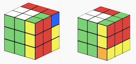

# Taming the Rubik's Cube (or How I met Group Theory)

## How the Rubik's Cube made the world a better place

Recently I've read the book [Cubed, written by Erno Rubik](https://semmi88.github.io/book_reviews/cubed.html) (the inventor of the cube), and this book rekindled my love for the Cube. The book details the process of invention and searches for reasons to explain its popularity. The argument put forth, with which I agree, is that it is not a coincidence that the Rubik's Cube became widely known around the world. There something universal, almost magical about it, and it is full of contrast and contradicitons: simplicity vs complexity, pleasure vs frustration.

The game itself is easy to understand, intuitive - there is no need for an instruction manual. A child and an adult can both understand the mechanics and the goal wihtin 3 seconds of holding the cube and playing with it. Nevertheles it is a challenging puzzle, even just after a couple of rotations our minds cannot follow the patterns and we can get lost, unable to find our way back to the unscrabled state. It is frustrating, because the difficulty of the puzzle is not evident from its simple, aesthetically pleasing appearance. The cube evokes emotions, as it is not what we expect. And we, as humans, are naturally curious and drawn to these types of challenges, we want to be able to understand its misteries and be able to tame the puzzle.

No wonder, that the Rubik's Cube became a cultural symbol, a symbol of intelligence and problem solving. It brought on a revolution in edutainment (education + entertainment) by offering fun ways to introduce mathematical concepts to kids. And in the process it made studying, thinking about problems cool again. I could even go as far as to say, that the Rubik's Cube gave us a universal value system on which we can all agree. As somehow, deep down, we can all agree that solving a scrabled cube is a good thing, being able to understand and solve complex puzzles is a useful skill in life, and in it is worth investing time to learn these skills.

## Solving methods and Cubing Basics

So how can you solve the cube? There are several well documented strategies, like the [layer-by-layer approach](https://ruwix.com/the-rubiks-cube/how-to-solve-the-rubiks-cube-beginners-method/), where you focus on completing each layer at a time by orienting and permuting the cubies. In total you need to learn about 5 algorithms, and with practice you will be able to solve the cube in around 2 minutes. That is pretty cool!  

Of course there are better, more advanced solving methods, but these require you to memorize more algorithms. Speedcubers, people who compete in cube solving world championships, learn about 200 different algorithms, which they can apply to different states of the cube, and so are able to solve a scrabled cube in under 10 seconds. Now that is impressive!

But where do these solving methods come from? Why do they work and how could you come up with a solving method? These are the questions that I will try to explore in this article. 

A first intuition about creating your own solving methods consist in the observation that every rotation can be undone. Meaning that if we know exactly the rotations that scrambled the cube, then the puzzle becomes trivial. We can just do those moves in reverse and we get back to the original state. This is a key observation, although on it's own it is not very helpful (as we usually don't know the rotations that scrabled the cube in the first place).

The difficult thing about solving the cube is that rotating any face moves a lot of pieces around, and it is hard to follow and keep up with all the changes. Ideally it would be nice to come up with algorithms that only affect a small part of the cube, only a small subset, like rotating two corners and leaving the rest of the cube unchanged. The good news is, that using intuition and bit of mathematics, we can come up with such algorithms. To be able to describe and discuss these algorithms, let's go over some cubing basics.

The Rubik's cube is made up of 26 tiny cubes (or cubelets), which can be grouped in three categories:
 - 6 center pieces, which have one colored face
 - 12 edge pieces which have two different colored faces (or facelets)
 - 8 corner pieces, which have three different colored faces (or facelets)

Solving methods usually are described using the [Standard Cube Notation](https://ruwix.com/the-rubiks-cube/notation/), which assigns a single capital letter to face rotations. 
 - 90° clockwise rotation of the 6 faces: F=Front, B=Back, R=Right, L=Left, U=Up, D=Down
 - 90° rotation of middle layers: E=Equator (between Up-Down), M=Middle (between Left-Right), S=Standing (between Front-Back)
 - Counterclowckwise rotations of 90° are described by adding an aposthrope: F' is the opposite (or inverse operation) of F
 - Multiple rotations are described by adding a number after the letter: FFF = F3
   - Turning a face 4 times leaves the cube unchanged (identity operation), so: F4=1
   - Three turns in one direction equal a turn in the opposite direction: F3=F' (meaning that 3 x 90 clockwise equals to a 1 x 90 counterclockwise turn)

## Hello Group Theory

The cube is a highly symmetric twisty puzzle. It can be studied using Group Theory, which is an abstract branch of mathematics that studies patterns and symmetries. To be more specific, the cube can be described as the mathematical structure called a permutation group. 

A permutation group is an ordered list of numbers, on which we define permutation operations. These operations can rearrange the numbers, in a certain ways, and also meet the four primary properties of a group (have Indentity Operation, have Inverse Operations, are Associative, exibit Closure). 

For example, in the case of the 2x2x2 Mini Cube we have 24 colored facelets (4 colors on each of the 6 faces). If we assign numbers to each facelet, the state of the cube can be described by an ordered list of 24 numbers. Then every twist on the cube basically just rearranges this ordered list. This way we can transform the problem of solving the cube, into studying lists of numbers.

### Non-commutativity makes the puzzle hard

An important thing to notice is that the face twists (these permutation operations) are non commutative. This just means that the order of operations matters, and changing the order might give us a different result. (This is also called non-abelian, after the mathematician Niels Henrik Abel).
 - this is different than multiplication, which is commutative, where reversing the order doesn't change the result 10 x 2 = 2 x 10
 - it is more like divison, where  10 / 2 ≠ 2 / 10

To see this non commutative property of cube rotations in action, let's just do the following sequence of moves - `R B` (right face rotation, followed by a back face rotation) - and check the end state of the cube. Let's compare this to the end state we get if we apply the operations in reverse order - `B R` (back face, then right face rotation). As we can see, the order matter, as we end up with different end configurations for the two cases: `R B` ≠ `B R`

**If you don't own a Rubik's cube, but want to follow along, just use this [neat online cube solver](https://rubiks-cube-solver.com/)**

And in fact this non-commutative property is what makes the puzzle hard, because we need to apply the rotations in a careful order. If twisting the cube faces would be commutative, then solving the cube would be trivial. To see this, let's take a simplified version of the puzzle, where we can only turn the front (F) and back (B) faces (all other rotation are not allowed). In this specific case, we have a commutative operations, because the front and back faces don't intersect (the facelets that they are permuting are independent of each other), and so the order of rotation does not matter. 

No matter how much someone scrambles the cube with these operation, the solution will be trivial. We know that making 4 turns of any face gets as back to the inital starting position. So if the front and back faces are not in the initial starting position, we just need to turn them 1,2 or 3 times (depending on the setup) and the cube is solved. So we can conclude that commutativity is boring, when it comes to cubing.

## Commutators - a cubers best friends

