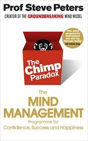

&leftarrow; [back to Book reviews](index.md)

**The Chimp Paradox - by Prof Steve Peters, 2012**

### The main takeaways of the book:
- **A mind model**: a useful way to think of our mind as an interplay of 3 distinct working parts:
  - a chimp - an emotional machine, impulsive, black and white thinking, seeks tribe and safety, geared towards survival in the jungle
  - a human - a rational thinker, takes perspective, seeks development, represents the person you want to be
  - a computer - preprogrammed behavior, habits, automatic thinking and acting 
- **A mind management strategy**: to improve your thinking, using the above model as a bases
  - understand information flow -> computer -> chimp -> human
  - program your computer with positive and constructive believes
  - learn to manage your chimp
  - have a way to stop blaming and criticizing yourself
  - identify unhelpful and destructive thinking
- Never beat yourself up
  - it intensifies stress unnecessarily, it is useless and damaging
  - it's not constructive, it won't make things better
  - it is a choice, you don't have to do it
  - instead choose to look more objectively, accept or improve, and encourage yourself

### The chimp

The chimp is the part of your brain/personality which is responsible for emotional reactions. It can be described with
 -  black and white thinking, no shades or alternative
 -  it can hijack your thinking and can represent behavior that you don't want
 -  impulse and will hijack you if you allow it
 -  it is not good, nor bad, it is a chimp
 -  it can be your best friend (and save your life) or it can be your worst enemy (an put you terrible situations)
 -  hence the paradox

The chimp is 5 times stronger than the human, so you cannot fight the chimp and win consistently.
Instead you need to learn to manage the chimp. You are responsible for your chimps, just as you would be responsible for your pet dog.

Managing the chimp:
 - exercise the chimp
   - let emotions and thoughts flow, vent it out, talk to someone, write it all down
   - after a while the chimp will be calmer
   - most things said/written like this are irrational and useless, but some might be important
 - box the chimp
   - tell some truths to the chimp, which will help put things in perspective
   - identify unhelpful and destructive believes
   - identify unrealistic expectations

### Unhelpful and destructive believes
Examples:
 - You are better/worse than others - vs - All humas are equal and worthy of repect
 - You worth is dependent on your achievements - vs - You are loved and worthy for who you are (your values, personality, attitude) and there's no need to achieve anything
 - (Although achieving things is a good thing)

Why do we fear of failing an exam?
 - we fear because of what others will think of us, and what that implies
 - self worth is tied to an exam result
 - imagine that you could take an exam in secret, the results would not be public, and you could retake the exam as many times as you wanted
 - Would you still fear the exam? Or you would look at it more like a challenge then?

### Unrealistic vs Realistic expectations
Lead to strong negavtive emotions, frustration, anger and disappointment
 
Examples:
 - I should always be on time and never be late - vs - I would like to on time whenever I can, and if I'm late I'll deal with it
 - All people should like me and be friendly - vs - Some people will never like you, no matter what you do and you can't do anything about it
 - Everyone should be pleasant and cooperative If I am with them - vs - Everyone chooses how they live their life and accept that some people are not pleasant and won't work with you
 - Nothing in my world should go wrong - vs - You can't have total control of your life, there are some aspects which you can and many which you can't control
 - Things will stay the same - vs - Things will always change, and you can work with change

Meeting new people:
 - reasonable expectation: show respect, listen, collaborate
 - unreasonable expectation: show interest in you and what you say, be enthusiastic and ask a lof of questions

Realistic expectations make you accept injustice and handle situations better. Sometimes the way we interpred experiences is more important thatn the experience itself.

Some examples of realistic expectations:
- life is not fair
- the goalposts move
- there are no guarantees
- people will make mistakes
- no one is all good, no one is all bad
- no one is going to agree with you all the time

### The computer
Contains preprogrammed thoughts and behavior. Programmes can be added and removed, if we stop and take the time to maintain it. Chimp and human look into the computer first for stored information, before acting, so the computer acts as a reference source.

### Other advices
Categorize thoughts to calm down an angry chimp:
 - helpful/unhelpful?
 - truthful/unrealistic?

Replace should/must thinking with could:
 - should/must - sense of guilt, judgement, failure
 - could/might - possibility, empowerment, potential for change
  - I should - vs - I could eat sensible
  - I should -vs - I could be organized

Undestand others instead of judging
 - others have a chimp as well and sometimes it behaves in ways they don't want to
 - forgive people for loosing control of their chimp at times, as you would forget yourself

Assertive vs Aggressive:
 - assertion: calm statments, removes emotions
   - what you don't want
   - how does it make you feel
   - what you do want
 - agression: attacking and emotional

Problem solving with successful thinking (human):
 - first look at yourself: 
     - how much you, your attitude contributes to the problem? no excuses
     - what can you do? how can you change your believes, be more realistic?
 - second look at circumstances: 
    - how do the circumstances contribute? how can they be changed? ask for help?
 - third look at other: 
    - how do others contribute? how can you help others?
    - engage using a solution focused attitude (not a win-lose attitude)
    - seek for mediation or support from neutral person

Chimp reverses the order of thinking, which makes it less useful as if does not make you change and learn from a problem.

Dreams vs Goals
 - differentiate between what you can and can't control
 - attainment (to pass the exam) vs effort (do your best to prepare)
 - dream is a possibility, the goals are supporting the dream
 - celebrate partial successes
