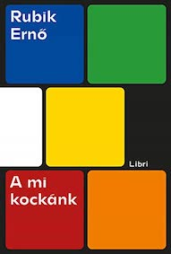

&leftarrow; [back to Book reviews](index.md)

**A mi kockánk - Rubik Ernő, 2020**

## Életút
 - A BME-n végzett építészetet, majd az Iparművészeti Főiskolán továbbképzést, itt kezdett el tanítani is
 - Ábrázoló geometriát is tanított például, ami a térlátásnak a nyelve
 - *Kierkegaard: "Az életet csak visszafele lehet megérteni, de élni előre kell"*

## Inspiráció
 - a kocka feltalálása nem a semmiből jött, voltak elődei, hasonló játékok amik inspirációként szolgáltak
   - Szóma kocka - hét darab különböző formájú elemből kell kirakni egy 3x3x3-as kockát (több mint 1 millió féle megoldás)
   - McMahon kocka - harminc kis kocka, különböző színű oldalakkal. Egy kockát kiválasztva, össze kell rakni egy 2x2x2-es kockát, 8 kiskockából, úgy hogy a nagy kocka oldalainak a színe egyezzen meg az először kiválasztott kis kocka oldalának színeivel

## A Kokca története
 - 1974 - kérdés vetődött fel benne, hogyan lehetne 8 kiskockát összeépíteni egy kétszer akkora nagy kockává, hogy a kockák szabadon mozogjanak, de végig együtt is maradjanak. A kocska mely pontjainak a helyzete nem változik forgatások során? (a középppont)
 - Amikor elkészült, egy hónapig tartott kirakni az összekevert kockát.
 - 1976 Magyarországi szabadalom bejegyzése, Háromdimenziós logikai játék
 - 1977 forgalmazás Magyarországon - Bűvüs-kocka néven
 - 1980 - forgalmazás USA-ban partnerek segítségével, Rubik's Cube néven, mert ezt lehetett levédeni
 - 1980-1983 első kocka láz

## Tanulás
 - a rejtvényeknek és a játéknak, nagy szerepe van az tanulásban/fejlődésben
 - Egy játékos hozzáállás egy feladathoz/problémához mindig segít, mert akkor nyugodtabbak vagyunk, jobban kifejezzük önmagunkat, nem idegeskedünk azon, hogy mindent jól csinálunk-e
 - Az emberek képesek elvonatkoztatni, a valóságot fogalmak segítségével megragadni, majd e fogalmak kombinálásával képesek a valóságra vonatkozóan helyes előrejelzéseket adni
   - Einstein a fénnyel
   - Eratoszthenész a föld kerületével
 - Emberi motiváció
   - belső: tudás, kíváncsiság, teljesítmény?, stimuláció?, elérni amit megpróbáltuk elérni
   - külső: jutalom (pénz), büntetés, társadalmi/közösségi elismerés

## Miért vált kúltúrális szimbólummá
 - egyszerű és komplex 
 - pozitív (játék) és negatív (bosszúság) élmények kötődnek hozzá 
    - a sikerhez  a kudarcokon át vezet az út, de a sikerből sokkal kevesebbet lehet tanulni
 - az intelligencia és problámamegoldás jelképe
 - számos filmben, zeneműben, festményeken, graffitiken szerepel
   - Snowden ebben rejtette el a pendrive-ot, amin kicsempészte a fileokat
   - Nagy hatással volt a játékiparra, a rejtvényekre

## Cubing  
 - Sportággá is vált, speedcubing, a World Cubing Association szervezi a világbajnokságot
 - a jelenlegi rekord 3,47 másodperc (5 keverésből, a legjobb és a legrosszabb időt elhagyva, a maradék három átlaga)
 - a versenyeken van a legjobb idő, illetve a legkevesebb forgatásból való megoldás, ahol papír és ceruza segítségével kell kitervelni a megoldást
 - God's number, az kocka isteni száma, azaz legkevesebb hány forgatással lehet kirakni
    - Matematikusok a Google segítségével bizonyították, proof by exhaustion, hogy 20
    - vagy 26, ha a duplaforgatást két forgatásnak számítjuk
 - DeepCube algoritmus, amely autodidakta módon, reinforcement learning tanulta meg kirakni a kockát.

