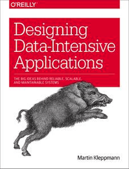

&leftarrow; [back to Book reviews](index.md)

**Designing Data-Intensive Applications - by Martin Kleppman, 2017**



## Main ideas and overview of the book:
Many applications today are Data-intesive vs Compute-intensive:
 - raw CPU power is the not limiting factor
 - the primary challenge is data - data quantity, data procesing speed, data complexity

Big questions/hard problems:
1. How to handle load?
 - indexes to speed up reads (range queries? hot indexes?)
 - replication read scaling/latency improve
 - partitioning data size scaling & read/writes scaling
   - skewed/hot partitions? rebalancing?
2. How handle failures?
 - replication - failover/catch-up revocery 
   - lag? consistency guarantees? conflict resolution?

Maind data dsitribution strategies: **Replication & Partitioning**

Table of contents:
* Part 1 - focused on data storage & retrieval on a single machine 
  * [Chapter1 - Reliability/Scalability](#chapter1---reliabilityscalability)
  * [Chapter2 - Data Models & Query Languages](#chapter2---data-models--query-languages)
  * [Chapter3 - Storage and retrieval](#chapter3---storage-and-retrieval)
  * [Chapter4 - Encoding and Evolution](#chapter4---encoding-and-evolution)
* Part 2 - data storage & retrieval on multiple machines
  * [Chapter5 - Replication](#chapter5---replication)
  * [Chapter6 - Partitioning](#chapter6---partitioning)
  * [Chapter7 - Transactions](#chapter7---transactions)
  * [Chapter8 - Trouble with distributed systems](#chapter8---trouble-with-distribuited-systems)
  * [Chapter9 - Consistency and Consensus](#chapter9---consistency-and-consensus)
* Part 3 - building derived data systems - dataflow architecture
  * [a]()
  * [a]()
  * [a]()
	
## Chapter1 - Reliability/Scalability

Describing Load:
 - specific to your system
 - e.g: volume of reads/writes, volume of data to store, distribution of followers per user

Describing Performance:
 - Throughput - in offline/batch systems (nr of records per second, total processing time of dataset)
 - Response time - in online/interactive systems - percentiles - median p50, p95, p999 (1 in 1000) - tail latencies
  
## Chapter2 - Data Models & Query Languages

Declarative Query Language (SQL) vs Imperative Query API
 - more concise
   - hides implementation details, allows for database system to intorduce improvements
   - decouples client code from database engine details
   - more limited in funcionality, which give  more room for optimizations in database

MapReduce a hybrid - selection query, with map and reduce user specified by code
 - map(record) -> emit(key, value)
 - group and sort by key
 - reduce(key, value) -> for each key called once, to produce final result


Relational Model - classic approach
 - if self-contianed data with mostly one-to-many relationships - Document Model better
   - less data locality, needs to join information
 - if lost of many-to-many relationship, anything can be connected - Graph Model better
   - complicated queries, several levels of joins needed, number of joins not fixed
 - schema-on-write - table update/backfill needed for schema change


Document Model
 - suitable for tree-like structure (mostly one-to-many relationships)
   - easy to represent: one-to-many relationships
   - hard to represent: many-to-on, many-to-many - data duplication, manual/client side joins - reference resolution
 - data locality
 - schema-on-read - easy to incorporate schema changes


Graph-Like Model
 - suitable for lots of many-to-many relationships
 - flexiblity to add edges, vertices
 Property Graph Model
  - vertices (properties) + edges (properties - head - tail - label)
Triple Store  (RDF - Resource Description Framework)
  - (subject, predicate, object) - does not distinguish between properties and edges - predicates used for both
    - subject (vertex) + prediate (property name | edge label) + object (property value | vertex)

## Chapter3 - Storage and Retrieval

* For efficient lookups we need an index
* For efficient range lookups, we need a sorted index
* But each index comes with write overhead cost
* To recover from crases - write-ahead log or redo log


Storage engine types:
```
- in-memory only (limited in size)
- log-strcutured storage engine
	- in memory hash index or sorted/sparse index
	- in-memory memtable - balanced tree to sort
	- disk based sorted log database (SSTable, LSM tree) - append only
- page-structured storage engines
	- disk based B-tree index
	- disk based database - in-place updates
```
In-memory hash-index 
 - simple index, append only writes
 - cons: if many keys, it does not fit in RAM
 - cons: no support for range queries, only exact queries

SSTable/LSM-Tree 
 - sorted, sparse, index, write firts to memory - updates appended
 ```
- in-memory writes to a sorted+balanced tree - periodcally write to disk (sorted+compacted)
- keep in-memory spare index for each segment written to disk - sparse is enough because values are sorted
- values can be repeated, needs to check in specific order, from more recent to least recent segements
- bloomfilter for quickly discarting non-members
```
B-tree 
- sorted index, write to disk - update-in-place, overwrite
```
- works with fixed-sized blocks/pages
- each page stores key range boundaries and references to child pages - starts from root page
- high branching factor -100-500, few levels
- easy to add new key/split a page, tricky to delete
- pros: keys are stored in one place, easier to lock/make transactional
```

Write Performance - LSM-tree wins
 - lower write amplification and sequential operations/compression
 - B-tree higher write amplification (redo log, page, split/parent page)

Read Performance - B-tree wins 
 - fewer operations (˜4 page reads, 4 deep B-trees)
 - LSM-tree might need to check several data structure/SSTables in compaction

Access Pattern differences
 - OLTP - transactions - low latency, small nr of records
 - OLAP - analaytics - bulk, aggregates over large nr of records

Column-Oriented Stotage
 - if rows are a large (100+ columns) and we need to aggregate and extract a couple of columns (3) - row based storage is highly inefficient
 - compression
 - different sorting order (write have to go first to memory, and merged to disk later)


## Chapter4 - Encoding and Evolution

Data Encoding/Serialization is tranformation
 - from memory efficient data structures (with pointers)
 - to sequence of bytes (on disk, or over network)

Evolvability
 - Data outlives code
 - Rolling updates - nodes with different verisons
   - backward compatibility (new code reading old data)
   - forwards compatibility (old code reading new data)

Data Encoding formats:
- programming language specific 
  - single language
  - weak support for versioning
  - not performant
- textual (XML, JSON, CSV) 
  - simple
  - datatypes are ambigous (number encoding) and limited (no binary string support - base64 workaround)
  - schemas are optional, too complex, rarely used
- binary (Thrift, protobuf, Avro)
  - more compact (50% less)
  - mandatory schemas - enforced documentation, typed checking, evolvability
  - add new fields - optional or must have defaults
  - delete existing optional fields only
  - never reuse tag numbers

---

## Chapter5 - Replication

Shared nothing architecture 
 - independent machines, no access to other's memory disk - communicate through network
 - cheap, commodity hardware
 - more complex software required for coordination and high reliability

Shared memory or shared disk architecture 
 - mahcines can access other machines memory/disk
 - more expensive hardware, contention and locking overhead 
 - less software complexity


Main approaches to replication:
 - Single Leader
 - Multiple Leaders
 - Leaderless - (quorum)
 
Quorum
 - n nodes, w - write quorum, r - read quorum
 - if w + r > n - overlap, there is at least on node up to date
 - for partitions - if home partition is down - use other nodes
   - sloppy quorum and hinted handoff 
  - durability OK, but consitency violated, could read non-latest value

Node failure
 - follower - catch-up recovery
 - leader - failover

Replication implementation
 - statment based (SQL forwarded) - cannot handle non-determinism (now, random)
 - write ahead log - low level (bytes on disk) - tied to storage engine
 - logical row-based - high level (before, after) - decoupled from storage engine

Hard problems: Consistency guarantees & Conlfict resolution

Consistency guarantees - eventual consistency, replication lag
```
- Read-Your-Own-Writes
	- client remeber last logical timestamp, and compare with replica's logical timestamp
- Monotonic Reads - (different answers from replicas - disappearing writes)
	- always read from same replica for a given user
- Consistent Prefix Reads - (see writes in the same order)
	- happens for partitions
	- no easy solution - keep track of casual dependencies
```
Conflict resolution - where multiple parallel writes might happen (Multi-Leader, Leaderless)
```
- Conclift avoidance - each user writes to the same leader
- Last-Write-Wins - durability violated
- Merging values - set, list
- Record conflict - delegate to app layer, user resolution
- Read Repair (for quorum reads)
- Versioning for each key in DB
	- client must read before writing (DB returns version, client sends version)
	- concurrent values are kept as siblings - need for conflict resolution
	- version vector - one version number per replica
```

## Chapter6 - Partitioning

When you have so much data that it is not feasable to:
  - store on a single machine
  - process on a single machine

Partitioning spreads the data and query load accross many machines
 - Large dataset - distribuited across many disks
 - Large query load - distribuited across many CPUs

Record -> Partition -> Node

Two main approches:
```
- partition by - Key Ranges
	- sorted, supports range scans
	- certain access patterns could lead to hotspot - date key, recent data
- partition by - Hash of Key Ranges
	- randomizes data, breaks hot spot patterns
	- but cannot be range scanned
```

Problems

Skewed partitioning, hot spot
 - nodes with more data or more query than other nodes
 - append random digits to key - spread write load to 10 partitions, but also increas read load to 10

Secondary indexes - don't map neatly to partitions
 - local si - each node stores the indexes of data written to it (by Document)
   - easy write, complex read (scatter/gather)
 - global si - partitoned differently from primary key, each node has some terms (by Term)
    - easy reads, complex writes (one write may affect many partitions/nodes) 
    - on writes, asynchronous update of global secondary indexes

Rebalancing - changing data size
 - hash mod N -> bad idea
   - when adding/removing nodes - all patritions change
 - random partition boundaries  -> good idea
   - needs hash key for continous ranges
   - "consistent hashing" - as only a few partitions change when adding nodes
 - fixed number of partitions 
   - as data grows, partitions grow
   - node added - fewer partitons per node - steals form other nodes
 - dynamic number of partitions
  - fixed sized partitions - split/merge as data increases
  - fixed number partitions per node - datasize increases partitions, add nodes decreases


Request routing
 - where is my data?
   - how has the information? - client (complex app) / a routing tier (from coordination service) / all nodes (gossip protocol)
 - service discovery problem
   - how to learn about changes? - coodrination service - Zookeper - authoritive mapping of partitions->nodes

## Chapter7 - Transactions

Transaction 
 - purpose - to simplify the programming model - for applications accessing a database
 - give safety guarantees - in case of error scenarios and concurrency issues
 - concurrent write, constraint violation, crash, network failur, disk failre, hardware/sofware faults => simplified to commit or abort

ACID
 - Atomicity - Abortability of transactions - takes care of partial error
 - (Consistency - Consistent state of the data between transactions - not really related to database, the application's responsability)
 - Isolation - Concurrent transactions don't interfere with each other - different levels
   - handling race conditions
 - (Durability - Committed transaction data will not be lost - written to disk & replicated)

(Transaction) Isolation Levels
```
Read commited
 - prevents dirty reads - read of uncommited 
   - (two versions - commited vs transaction-in-progress)
 - prevents dirty writes - ovewrite of uncommited (row-level locks)
Snapshot Isolation ~ Repeatable Read
 - writers block writers, readers never block (writer nor reader)
 - good enough for small read/write transactions and long-running read-only
 - prevents read skew - timing anomaly, see different part of the database at different point in time 
   - while ongoing transaction A, it sees commited changes to the database by another transaction B 
   - instead of a consitent snapshot as it was at the beginning of transaction A (multi-version conccurency control)
Serializable (guarantees some serial order)
 - prevents lost updates - timing anomaly
   - two concurrent read-modify-write transactions, the first overwrites the write of the second without incorporating the changes
   - (atomic operations / explicit lock / autodetect and abort / compare-and-set)
 - prevents write skew - timing anomaly, two transactions read-and-updating two different objects based on a premise, that is outdated 
   - phantoms - query some condition, another write affects the results of the query, outdated premise (block data not commited yet)
   - at least on oncall, room double-booking, double-spending, duplicate-username chosen
```	

Implementations
  - materializing conlficts - complex implementation
  - single threaded execution - does not scale ~ it's like locking the entire database
  - 2PL (two phase locking) - does not perform well
    - readers block writers (but not reader)
    - writers block readers (and writers)
    - lock modes shared mode(read-read okay)/exlusive mode
  - **SSI (Serializable Snapshot Isolation)**
    - detect outdated premise in transactions
    - detect reads of potentially stale value MVCC (uncommited write occurs before read)
      - only an issue if we want to commit that read value - optimistic approach
    - detect writes that affect prior reads (write occurs after read)
      - allow to proceed, aborted if not serilaziable - optimistic approach
      
## Chapter8 - Trouble with Distribuited Systems

No shared memory (shared nothing architecture) - communicate via network
 - unrelibale network - variable delays (swtich / VM / OS - queues), lost/delayed packets
 - unreliable clocks
 - process pauses (GC, CPU context switch, VM, I/O)

All this can lead to partial failures and nondeterminism.

How to handle network faults?: *timeout*

What is the correct *timeout* value?
 - networks can have unbounded delays, no guarantees
 - timeout too long - blocking app/user waiting/unused capacity
 - timeout too short - declaring a node dead prematurely - double execution of an action, failover -> which may cause cascading failures
 - no "correct" value, determined experimentally

Trade-off: **Bounded delay vs Resource Utilization**

Circuit-switching
 - telephone netwrods, ISDN
 - fixed bandiwth allocation -> know bandwith requriement for a call
 - bounded delay/latency -> but worse resource utilization

Packet-switching
 - Ethernet and IP
 - dynamic bandwith allocation -> unknown bandwith requirements, optimized for bursty traffic
 - variable delay/latency -> but better resoure utilization

Unreliable Clocks - pitfalls
 - leap seconds, time-of-day clock might jump backwards
 - quartz clock drifting, nodes with different time
 - NTP synchronized - not reliable 
   - local time servers is *<10ms* drift (best case scenario)
   - remote time server *<100ms*

Physical clocks 
 - time-of-day (might jump back-forward)
 - monotonic (might jump forward)
Logical clocks
 - strictly monotonic


Trade-off: **Cost vs Reliability**

Hard Real-Time Systems
  - expensive, bounded delay but a lower throughput
  - special OS (RTOS), languages, libraries, tools

Byzantine Faults - (hard to deal with, usually assumed not to happen)
 - compromised nodex/untrusted parties
 - arbitrary faults, corrupted responses


Philosophical:
 - in a distribuited system - how can we know anything, if the mechanism of perception and measurement is unreliable?
 - makes assumption about the system behavior (system model)
 - design to provide guarantees under these assumptions


Truth is defined by the majority
 - cannot rely on a single node, must rely on quorum
 - individual nodes must abide quorom decisions
 - leader and the lock
   - fencing tokens - sequence number - to avoid long pause caused inconsistencies, lock expired but not known by node leasing it
     - return a sequence number when lock is requested/leased
     - send senquence number when writing using lock 
     - compare to see if it's the latest sequence number, or newer one has been issued

## Chapter9 - Consistency and Consensus

Distributed Consistency Models 
```
Linearizability (~Consistency in reads/writes)
- total order - sinlge copy of data and all operation are atomic
- recency guarantee
- single up-to-date value - that all nodes agree on
- coordinating state of replicas in face of delays/faults 
- slow, proportial to deays in network, coordination overhead, comes with performance hit

Casuality (Caually consistent)
- partial order, casual oredering
- casaully related events are ordered (happens-before)
- non related events are concurrent, no order defined
- can be implemented without performance hit
```

Ordering - helps preserve casuality
  - Sequence number ordering - OK in a single-leader system
  - Lamport timestamp - in a mulit-leader/leaderless system
    - each node has a counter and an ID
    - maximum counter values is tracked and always sent - nodes update their counter

Total Order Broadcast - Atomic Broadcast
 - messages are guaranteed to be delivered reliably in a fixed order 
   - reliable message delivery (if delivered to one node, delivered to all nodes)
   - total order delivery (delivered in the same order for every node)
   - there is no guarantee WHEN a message will be delivered - nodes could lag behind
 - every node processes the same writes in the same order (replication log, transction log, write-ahead log, lock log)


CAP Theorem - when Partitioned network, choose one:
 - Consistency (linearizability) - consistent reads/writes - disconnected nodes wait/return error (unavailable)
 - Availability - disconnected nodes process request independentyl - (non-linearizable, ~not consistent)

Problems with CAP
 - considers only on consistency model (linearizability)
 - considers one kind of fault (network partition - not delays/lost packets)

Consensus
 - most important and fundamental problem in distributed computing - get all nodes to agree
 - but not every system requires consensus - maybe it's okey to have multiple leaders/conflicting values - branching/merging version histories
 - equivalent to other problems
   - linearizable compare-and-set/increment-and-get register  
   - Total Order Broadcast
   - locks and leases
   - mebership/coordnation 

Coordination/Consensus services - ZooKeeper and etcd
 - small database, holding data in memory, slowly changing data
 - replicated across nodes consistently - using fault-tolerant total order broadcast
 - small number of nodes (3 - 5) - easier to perform majority votes, than on thousands of nodes

"Outsourcing" some of the work of coordinating nodes
 - leader election -> implemented by distributed lock, linearizability - all nodes must agree who has the lock
 - allocating work to nodes - job schedulers
 - rebalancing partitions
 - service discovery - who is the leader 
   - read only cache replicas, not voting, just to serve reads that not need to be linearizable (like DNS - availability > staleness)
 - membership service - active live members of a cluster with consensus


Fault-Tolerant Consensus Algorithms:
 - Viewstamped Replication
 - Paxos
 - Zab (Zookeeper - Hadoop, Kafka)
 - Raft (etcd - K8)

2-Phase-Commit - 2PC -> (comes down to a single node atomic commit on the coordinator)
 - coordinator - hands out unique transaction ID
   - prepera request - participants acknowledging will wait indefinitely for coordinator decision
   - commit/abort request - coordinator decision - written to disk first - send to participants
   - in case of error/timeout - retry forever
 - problems - coordinator failure recovery
   - could never return - indefinite wait for decisions or loss of atomicity guarantees
   - corrupted log, requiers manual conflict resolution or loss of atomicity guarantees


Consensus is easy - if we have the leader node
 - but what happens if leader node fails
 - we wait for the leader node to recover indefinitly
 - or human selects the leadaer node - "act of God"

Fault-Tolerant Consensus (unifrom consensus) is hard 
 - because of has to satisfy livenes property (Termination) - make progress, eventually a decision has to be made
 - of course if all nodes crash there cannot be a consensus 
 - there is a limit, consensus algorithms require the majority of nodes to be working correctly for termination


Chicken and the egg problem
 - problem of split brain - two or more nodes believe they are the leader and get the database into inconsistent state
 - so to elect a leader - we need consensus
 - but to reach consensus - we need a leader to decide from proposals

Given a weaker guarantee - unque leader within each epoch
 - two rounds of voting
   - leader election - increases the epoch, quorum majority (the highest number wins if multiple leaders)
   - leader proposal for every decisions - has to wait for quorom majority approval 
   - overlap between the two 
     - at least 1 node who approved the proposal, participated in latest leader election
     - so there is no higher epoch that would conflict, the leader still holds the leadership 
 - voting is like synchronous replication - comes with a cost
 - if a flaky network, the system could be stuck in leader reeleciton instead of doing actual work
		
---

## Chapter10 - Batch processing


- Bounded input - file containing recrods
- Uses filesystems
- Periodically processing

On a sinlge machine only
	Unix tools efficiency
		- do one thing well
		- immutable input, stateless, no side effects, repeatable (pure functions)
		- composability, pipe
			- universal interface input/output - file description, ordered sequence of bytes separated by \n
			- separation of logic from wiring - input/output can be redirected
		- efficient implementation - sort - can spill to disk, uses sequential access patterns, uses multiple CPUs


On multiple machines 

	Distributed Batch Processing has to solve:
		- partitioning
		- fault tolerance - save to disk, retry

	MapReduce-Hadoop ecosystem
		- used to build search indexes (full-text/fuzzy index)
		- used to build key-value data files (ml recommendations,classificaion precompute)
	Higher level programming models
		- Pig, Hive, Cascading, Crunch

	HDFS - distributed filesystem
		- NameNode keeps track of which file block on which node
		- deamon process on each node - exposing a network service to allow other nodes to access files

	Map_Group/SortMerge_Reduce (similar to UNIX pholosophy)
		- immputable inputs - input/output HDFS direcroty 
		- no side effects (preferrebly)
		- repeatable
		- composable - MapReduce jobs ca be composed as well, separation of logic and wiring I/O directories
		- Mapper 
			- take a file block input, and iterate over recods
			- extract [key,value] pairs from each records
			- sort by key
			- write to disk
		- Reducer - assigned some keys/partitions
			- connect to each mapper 
			- download files of sorted [key,value] pairs (corresponding to it's partition)
			- merge sorted files together
			- iterate over keys and produce output - (could be the input for next map reduce job)

	Reduce-Side Join / Sort-Merge join
		- mapper output is sorted by keys
		- reducers merge together sorted keys 

	Map-Side Join
		- small side of join in memory (broadcast hash)
		- both sides of join use same partitions, small side in memory


MapReduce/DataFlow Engines/MPP

	MapReduce vs MPP (Massively Parallel Processing Databases)
		- general-purpose storage
			- HDFS - read/write data in arbitrary format (sequence of bytes) any data model, any encoding (not just relational model)
			- dump data and figure out how to process later
		- general-purpose processing
			- SQL query execution supported
			- arbitrary code execution in Map/Reduce callbacks (ml systems precompute)
		- fault tolerance - restarting of failed tasks
		- sparing use of memory - eager to write to disk - for fault tolerance + assumption that data does not fit in memory

	Beyond Mapreduce - Dataflow Engines
		- offer a more flexible programming model and processing speed up
			- not just Map-SortMerge-Reduce steps, arbitrary Operators (skip sort if not needed)
				- Operators, just like in MapReduce, are user functions that process one record at a time on a single thread
			- don't save intermediate results to HDFS/replicated if not needed (keep on local disk only)

		- Tez - light wrapper over YARN
		- Spark - RDD for tracking data ancestry for fault tolerance
		- Flink - checkpointing state for fault tolerance

Graph data
	- iteravite processing - Pregel processing model 
	- process one vertex at a time, vertexes send messages to other vertexes for the next iteration
		- could be slow due to lots of cross-machine communication
		- small data could be processed on a single-machine (GraphChi)
