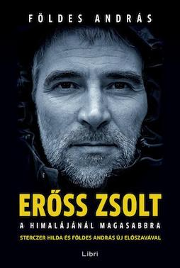

&leftarrow; [back to Book reviews](index.md)

**Erőss Zsolt a Himalájánál magasabbra - by Földes András, 2013**

### Miről szól?
* Erőss Zsolt hegymászó karrierját mutatja be
* Kegyetlen sport, hivatás a hegymászás - minden csúcsmászás kockázatos és a szerencsén is sok múlik, gyakoriak a tragédiák
* A hegyek és a kihívások szeretete jellemezte - "Az Everest nem a fő cél a hegymászóknak, hanem csak egy a sorban. A lényeg, hogy az ember szép kihívásokat keressen magának, és azokat megpróbálja teljesíteni"
* A balesete után Zsolt nem csüggedt, örült hogy túlélte és a rehabilitációra koncentrált. Ez is ugyanolyan kihívás volt, mint egy csúcs. Jól körülhatárolható, egyértelmű cél, amelynek eléréséért mindent bele kellett adnia.

### Főbb témák:
* Erőss Zsolt rendkívül tehetséges, elkötelezett hegymászó volt. De mint minden kiemelkedő, élsportoló, nem a semmibol, egyik naprol a másikra érte el az eredményeit. 
  * Kisebb sziklamászásokkal kezdte, hegymászo klubbokhoz csatlakozott, fokozatosan fejlesztette magat. Masok altal szervezett turákon vett részt, es egyre magasabb csúcsokat hódított meg.
* A 90-es evek magyar expedíciói nem voltak a legjobban felszereltek
  * A mászók saját maguknak kellett megteremtsék a turákhoz szükséges pénzt, például ipari alpinista munkával
  * Így nem marad idő sem a megfelelő edzésekre, az utázas is általaban az olcsóbb es kényelmetlenebb formában történt, es a felszerelés sem volt a legmegfelelőbb minden esetben
  * Mindemelett megis sikerült nagyszerű eredményeket elérniük a magyaroknak, és főképp Zsoltnak, aki kiváló tehetség volt
* A hegyen nagyon sok minden mehet rosszul
  * A magashegyi beteség
    * mindenkire másképpen hat, fejfájás, hányinger, étvagytalanság, fáradság a kezdeti tünetek
    * oxigénhiány miatt lép fel: 5000 méteren mar az oxigénszint csak a fele a tengerszinten mértnek, 8000 méteren pedig csak a harmada
    * "Big Headache Mountains" a Himalája leírasa, ősi kínai feljegyzésekben
    * 7000 méter fölötti magasságot már halálzónának nevezik, mivel itt a szervezet folyamatosan épiti le magat, nem lehet pihenni, menni kell vagy fel, vagy le.
  * Az időjárás kiszámíthatatlansága
    * az a csúcs ami szép időben simán meghódítható, viharban emberi életeket követelhet
    * a hideg, párátlan levegőtől kiszárad az ember, a hidegben elfagyhatnak a végtagjai
    * a napsütésben megolvadt hó, illetve a friss hó lavinákat, kőhullásokat okozhat
    * a szél lesodorhatja a mászokat a hegyről
* Akklimatizáció
  * a szervezet szoktatása a magashegyi, oxigénhiányos környezethet
  * fel és le kell túrázni a hegyen (climb high, sleep low), az alvási magasságot napi 600 méterrel ajánlott csak emelni
  * viszont ahogyan egyre magasabbra merészkedunk, egyre súlyosbodnak a tünetek
  * minden magashegyi csúcsra többnapos, táborláncon keresztüli túrával lehet feljutni. Több éjszakat is a hegyen kell tölteni
* Igázabol minden csúcstámadas kockázatos vállakozas
  * Ha valaki racionálisan, otthona melegéből mérlegelne, meg sem érné elindulni
  * Érdekes kérdés, hogy akkor mégis miért vállalják be önkent ezt a mászók, és miért vágnak bele úrja es újra ilyen rizikós és hatalmas megprobáltatásokba?
* Zsolt a tisza alpinizmus híve volt
  * oxigén palack nélküli mászott és maga cipelte a felszerelésést a hegyen (sátrat, hálózsák, élelem, főző), nem támaszkodva serpákra
  * ennek szöges ellentétje a kereskedelmi expedíciók, ahol teherhordók serege és hegyi vezetők segítik az amatőr mászókat, akik oxigén segítségével hódítják meg a csúcsokat
* AQ - Adversity Quotient - megpróbáltatás kezelési képesség
  * jellemzői: aktív, sikerorintáltság, nem töri le a kudarc, sőt ösztönzi hogy tanuljon a hibáiból és tapasztalatot szerezzen
  * A magas AQ-val rendelkező embereket "hegymászó típusnak" nevezik

### Erőss Zsolt expecídióji:

1994 - Hópárduc cím - az Orosz Hegymászó Szövetség fokozata, a volt Szovjetúnió öt 7000 méter fölötti csúcsot meghódíto mászok nyerik el (a legmagasabb a Kommunizmus csúcs 7495)

1996 - Everest 8848m - fizetős expedíciók által uralt déli falon történt tragédia, a váratlanul kitörő vihar miatt. Aznap többszázan indultak a csúcsra, torlódások voltak es egy nap alatt nyolc mászo vesztette életet (a tragédiát filmben is feldolgozták). Ezzel egy időben a magyar expedíció az északi oldalrol mászott, a kínai mászóengédely olcsóbb volt. A csúcstámadas sikertelen volt, és Zsolt mászó társa Reinhard akut magashegyi betegségben meghalt a hármas táborban. Sok mindenben lehet keresni az okot, nem megfelelő felkészülés, felszerelés, oxigén nem használata, mert az nem tiszta mászás. A japán mászok botránya: ott hagyták a csúcsközelben szenvedő indiai mászokat, kikerülték feltele es lefele is, anélkül hogy segítettek volna rajtuk. Tudtak volna érdemben segíteni? Saját maguk életét kockáztattak volna? Vagy csak a csúcsesélyüket?

1999 - Nanga Parbat 8125m - engedély nélküli szóló mászás, sátor nélkül, kevés felszereléssel napok alatt (hetek helyett). Zsolt talán legnagyobb sikere.

2000 - Disteghil Sar, 7885m, Karakorum. Mászótársa, Dékány Péter a csúcsról visszafele megcsúszott, 5 métert esett puha hóba, de esés közben felpörgött szíve megállt, nem bírta a terhelést.

2001 - Everest 8848m, első expedíció ami finanszírozott, jól felszerelt volt, nagy magyar csapat vágott neki ősszel, Tibeti oldalról. Rossz idő miatt sikertelen volt a próbalkozás, és egy társuk Gárdos Sándor, Doki életét vesztette az egyik táborban a nagy szél széttépte a sátrakat és nem tudott visszaereszkedni.

2002 - Everest 8848 ismét, de most a Nepáli oldalról, normálút. Ez a legbejáratottabb, a fizetett, tömegexpedíciók útvonala. Egyik társuk, Peter Lagate kicsúszott és meghalt. Másik társuk, Ács Zoli, súlyos magashegyi tüneteket mutatott, csak oxigénnel, segítséggel és szerencsével élte túl, időben le tudták hozni. Zsolt és csúcsesélyes társa nem várták be, nem segítettek Zolinak, úgy értették az expedíció vezetője, serpákkal leviszi. Talàn nem akartàk beáldozni energiájukat? Végül Zsolt, oxigén segítségével, felért a csúcsra. Nem volt túl elégedett, kereskedelmi expedíció, normálúton, oxigénnel. Viszont a média és a közvélemény felfigyelt az eredményre, és így híres lett. Sok megkeresése volt, előadásokat tartott, meg tudott élni ebből. Elindították a magyarok a világ nyolcezresein programot Kollár Lajossal.

2003 - Gasherbrum II 8035m, a legsikeresebb magyar expedíció. Jó időt fogtaki ki, 9 magyar mászónak sikerült a csúcs meghódítása (első 3 magyar nő 8000 felett).

2005 - K2 8611m, Karakorum, rossz idő volt, nem volt csúcsmászára alkalmas ablak, senki nem jutott fel a csúcsra abban a szezonban

2006 - Dhaulagiri 8167m, Pakisztánból támadva , magyar csapatból egyedül Zsolt ért a csúcsra, de nagyot kockáztatott, a hármas táborból élelem, hálózsák, sátor nélkül vágott neki és nagy küzdelem és szerencse árán sikerrel járt

2007 - Gasherbrum I 8080m (& II ismétlése), Zsolt első közös expedíciója Hildával. Sikeresen megmászták mindkét csúcsot, Az elsőre hat, másodikra négy magyar is feljutott, nagysikerű expedíció. Zsolt ismét bevállalt egy felelőtlen, sátor/hálózsák nélküli csúcstámadást, de szerencséjére más mászók befogadták egy sátorba és jó időt fogtak ki.

2008 - Makalu 8481m - Kis magyar expedíció, csak 3 mászoval, Zsolt, Hilda, Mécs. Zsolt elérte a csúcsot, Hilda pedig szorongott és nem merte megtenni az utolsó lépéseket, amiert vádolta is magát utana. Zsolnak fagyási sérülései lettek, le kellett vágni egy kis részt a lábujjából. Hilda teherbe esett es összeházasodtak.

2009 - Manaszlu 8156m, újabb kis magyar expedíció Zsolt, Barna Daniel, Szabó Levente. Az expedíció alatt született meg Gerda, Zsolt es Hilda lánya, a hegymászónak emiatt érzelmileg is nehéz volt az mászásra, a hegymászó-tábori életre koncentrálnia. Kettőjüknek sikerült feljutni a csúcsra, visszafele ereszkedve viszont Levente kicsúszott es eltűnt a ködben, sötétedésben, fáradtan nem tudtak utána menni. Másnap találták meg megfagyva, de ebből a magasságból lehetetlen lett volna lehozni a holttestet. Levente családja nem fogadta el a tragédiát és Zsoltot, és az expedíciót vádolták mulasztással.

2010 - Baleset a Tátrában, szilveszterkor. Két kezdővel összekötve ereszkedtek, amikor a hótömeg megindult és a lavinával együtt csúsztak. Mindhárman túlélték, kisebb-nagyobb sérülésekkel. Zsolt lába csúnyán eltörött, az erek nem vittek vért az egyik lábfejébe, amputálni kellett. Zsolt nem csüggedt, örült hogy túlélte és a rehabilitációra koncentrált. Ez is ugyanolyan kihívás volt, mint egy csúcs. Jól körülhatárolható, egyértelmű cél, amelynek eléréséért mindent bele kellett adnia. Tornázott, műlábat tervezett és tervezte hogyan folytatja majd a mászást műlábbal. Ekkorra már a média lépten, nyomon követte.

2011 - Lhotse 8383m, miután továbbfejlesztette műlábát a Cso-Oju sikertelen mászása után, újabb komoly expedícióba vágott. Zsolt és Gál Laci is sikerrel járt, a világ negyedik legmagasabb csúcsán, az elszántság, az akarat, fontosabb mint két ép láb. A rengeteg kereskedelmi expedíció és tapasztalatlan mászó miatt azonban sokan kerültek életveszélybe, és csak nagy szerencsével és összehangolt mentőcsapattal lehetett elkerülni a tragédiát. Az alpinizmus egyfajta magashegyi turizmussá, cirkusszá vált, ahol életek forognak kockán. Sok amatőr mászó azonban még súlyos fagyási sérülések és életveszély ellenére is tervezte, hogy visszamegy egy nyolcezresre. Miért? Mert ettől fontosnak/érdekesnek érzi magát? És ez fontosabb akár az életben maradásnál is?

2012 - Annapurna 8091m, veszélyes lavinás hegy, nem sikerül az akklimatizáció, de azért nekivágnak Horváth Tibor és Zsolt. Nem sikerül feljutniuk, Tibi hamarabb visszafordul és a lavinás részen nyoma veszik. Zsolt később fordul vissza és nehezen ér le. Legjobb barátját, mászótársát vesztette el. Hazatérése után, összevesznek Mécs Laci-val régi mászótársával, Zsolt önfejűsége és Mécs kevésbé csapatjátékos volta miatt.

2013 - Kancsendzonga 8586m, - egy fiatal mászótehetséggel, Kiss Péterrel együtt mászták meg a csúcsot, egy hosszú, 24 órás mászás során. Zsoltnak ez volt a 10. nyolcezres csúcsa (a világ 14 nyolcezreséből). Sajnálatos módon visszafele ereszkedve, nem volt elég erejük elérni a felső táborokat és mindketten odalettek, a fiatal tehetség és a legnagyobb magyar alpinista.
