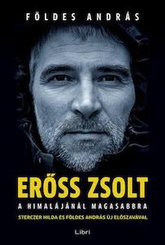

&leftarrow; [back to Book reviews](index.md)

**Erőss Zsolt a Himalájánál magasabbra - by Földes András, 2013**

### Miről szól?
* Erőss Zsolt hegymászó karrierját mutatja be
* Kegyetlen sport/hivatás a hegymászás

### Főbb üzenetek:
* Erőss Zsolt rendkívül tehetséges, elkötelezett hegymászó volt. De mint minden kiemelkedő, élsportoló, nem a semmibol, egyik naprol a másikra érte el az eredményeit. 
  * Kisebb sziklamászásokkal kezdte, hegymászo klubbokhoz csatlakozott, fokozatosan fejlesztette magat. Masok altal szervezett turákon vett részt, es egyre magasabb csúcsokat hódított meg.
* A 90-es evek magyar expedíciói nem voltak a legjobban felszereltek
  * A mászók saját maguknak kellett megteremtsék a turákhoz szükséges pénzt, például ipari alpinista munkával
  * Így nem marad idő sem a megfelelő edzésekre, az utázas is általaban az olcsóbb es kényelmetlenebb formában történt, es a felszerelés sem volt a legmegfelelőbb minden esetben
  * Mindemelett megis sikerült nagyszerű eredményeket elérniük a magyaroknak, és főképp Zsoltnak, aki kiváló tehetség volt
* A hegyen nagyon sok minden mehet rosszul
  * A magashegyi beteség mindenkire másképpen hat, fejfájás, hányinger, étvagytalanság, fáradság a kezdeti tünetek
  * Oxigénhiány: 5000 méteren mar az oxigénszint csak a fele a tengerszinten mértnek, 8000 méteren pedig csak a harmada
  * "Big Headache Mountains" a Himalája leírasa, ősi kínai feljegyzésekben
  * Akklimatizációs túrákkal lehet csökkenteni a tüneteket, az alvási magasságot napi 600 méterrel ajánlott csak emelni. Viszont ahogyan egyre magasabbra merészkedunk, egyre súlyosbodnak a tünetek
  * Minden magashegyi csúcsra többnapos, táborláncon keresztüli túrával lehet feljutni. Több éjszakat is a hegyen kell tölteni
  * A hideg, párátlan levegőtől kiszárad az ember, a hidegben elfagyhatnak a végtagjai
  * A friss vagy napsütésben megolvadt hó lavinkat, kőhullásokat okozhat
  * A szél lesodorhatja a mászokat a hegyről
  * Rengeteg minden múlik a szerencsen.
  * 7000 méter fölötti magasságot már halálzónának nevezik, mivel itt a szervezet folyamatosan épiti le magat, nem lehet pihenni, menni kell vagy fel, vagy le.
  * Az időjárás kiszámíthatatlan, az a csúcs ami szép időben simán meghódítható, viharban emberi életeket követelhet

* Igázabol minden csúcstámadas kockázatos vállakozas
  * Ha valaki racionálisan, otthona melegéből mérlegelne, meg sem érné elindulni
  * Érdekes kérdés, hogy akkor mégis miért vállalják be önkent ezt a mászók, és miért vágnak bele úrja es újra ilyen rizikós és hatalmas megprobáltatásokba?

* Zsolt a tisza alpinizmus híve volt
  * oxigén palack nélküli mászás
  * a mászók maguk cipelik a felszereléseiket (sátrat, hálózsák, élelem, főző), nem támaszkodnak serpákra, hordárokra a hegyen

AQ - Adversity Quotient - megpróbáltatás kezelési képesség - aktív, sikerorintált. nem töri le a kudarc, sőt ösztönzi hogy tanuljon a hibáiból és tapasztalatot szerezzen. A magas AQ-val rendelkező embereket "hegymászó típusnak" nevezik.

### Erőss Zsolt expecídióji:

1994 Hoparduc - az Orosz Hegymaszo Szovetseg fokozata, a volt Szovjetunio ot 7000 meter folotti csucsot meghodito maszok nyerik el (a legmagasabb a Kommunizmus csucs 7495)

1996 Everest - fizetos expediciok altal uralt deli falon tortent tragedia, a varatlanul kitoro vihar miatt. Aznap tobbszazan indultak a csucsra, torlodasok voltak es egy nap alatt nyolc maszo vesztette eletet. Ezzel egy idoben a magyar expedicio az eszaki oldalrol maszott, a kinai maszoengedely olcsobb volt. A csucstamadas sikertelen volt, es Zsolt maszo tarsa Reinhard akut magashegyi betegsegben meghalt a harmas taborban. Sok mindenben lehet keresni az okat, nem megfelelo felkeszules, felszereles, oxigen nem hasznalata, mert az nem tiszta maszas. A japan maszok botranya: ott hagytak a csucskozelben szenvedo indiai maszokat, kikerultek feltele es lefele is, anelkul hogy segitettek volna rajtuk. Tudtak volna erdemben segiteni? Sajat maguk eletet kockaztattak volna? Vagy csak a csucsesélyüket?

1999 Nanga Parbat - engedelynelkuli szolo maszas a 8125m-es csucsra, sator nelkul, keves felszerelessel napok alatt (hetek helyett).

2000 Disteghil Sar, 7885m, Karakorum. Mászótársa, Dékány Péter a csúcsról visszafele megcsúszott, 5 métert esett puha hóba, de esés közben felpörgött szíve megállt, nem bírta a terhelést.

2001 - Everest, első expedíció ami finanszírozott, jól felszerelt volt, nagy magyar csapat vágott neki ősszel, Tibeti oldalról. Rossz idő miatt sikertelen volt a próbalkozás, és egy társuk Gárdos Sándor, Doki életét vesztette az egyik táborban a nagy szél széttépte a sátrakat és nem tudott visszaereszkedni.

2002 - tavasz Everest ismét, dr most a Nepáli oldalról, normálút. Ez a legbejáratottabb , a fizetett, tömegexpedíciók útvonala. Egyik társuk, Peter Lagate kicsúszott és meghalt. Másik társuk, Ács Zoli, súlyos magashegyi tüneteket mutatott, csak oxigénnel, segítséggel és szerencsével élte túl, időben le tudták hozni. Zsolt és csúcsesélyes társa nem várták be, nem segítettem Zolinak, úgy értették az expedíció vezetője, serpákkal leviszi. Talàn nem akartàk beàldozni energiájukat? Végül Zsolt, oxigén segítségével, felért a csúcsra. Nem volt túl elégedett, kereskedelmi expedíció,normaluton,oxigennel. Viszont a média és a közvélemény felfigyelt az eredményre, és így híres lett. Sok megkeresése volt, előadásokat tartott, meg tudott élni ebből. Elindították a magyarok a világ 8000esin programot.

2003 - Gasherbrum II 8035, a legsikeresebb magyar expedíció. Jó időt fogtaki ki, 9 magyar màszónak sikerült a csúcs meghódítása (első 3 magyar nő 8000 felett).

Az Everest nem a fő cél a hegymászóknak, hanem csak egy a sorban. A lényeg, hogy az ember szép kihívásokat keressen magának, és azokat megpróbálja teljesíteni.

2005 - K2, rossz idő volt, nem volt csúcsmászára alkalmas ablak, senki nem jutott fel a csúcsra abban a szezonbab

2006 - Dhaulagiri 8167, Pakisztánból támadva , magyar csapatból egyedül Zsolt ért a csúcsra, de nagyot kockáztatott, a hármas táborból élelem, hálózsák, sátor nélkül vágott neki és nagy küzdelem és szerencse árán sikerrel járt

2007 - Gasherbrum I (& II ismétlése), Zsolt első közös expedíciója Hildával. Sikeresen megmászták mindkét csúcsot, Az elsőre hat, másodikra négy magyar is feljutott, nagysikerű expedíció. Zsolt ismét bevállalt egy felelőtlen, sátor/hálózsák nélküli csúcstámadást, de szerencséjére más mászók befogadták egy sátorba és jó időt fogtak ki.

2008 - Makalu 8481 - Kis magyar expedicio, csak 3 maszobal, Zsolt, Hilda, Mecs. Zsolt elerte a csucsot, Hilda pedig szorongott es nem merte megtenni az utolso lepeseket, amiert vadolta is magat utana. Zsolnak fagyasi serulesi lettek, le kellett vagni egy kis resz a labujjabol. Hilda teherbe esett es osszehazasodtak.

2009 - Manaszlu 8156, ujabb kis magyar expedicio Zsolt, Barna Daniel, Szabo Levente. Az expedicio alatt szuletett meg Gerda, Zsolt es Hilda lanya, a hegymaszonak emiatt erzelmileg is nehez volt az maszasra, a hegymaszotabori eletre koncentralnia. Kettojuknek sikerult feljutni a csucsra, visszafele ereszkedve viszont Levente kicsuszott es eltunt a kodben, sotetedesben, faradtan nem tudtak utana menni. Masnap talaltak meg megfagyva, de ebbol a magasagbol lehetetlen lett volna lehozni a holttestet. Levente csaladja nem fogadta el a tragediat es Zsoltot az expediciot vadoltak mulasztassal.

2010 - Baleset a Tátréban, szilveszterkor. Két kezdővel összekötve ereszkedtek, amikor a hótömeg megindult és a lavinával együtt csúsztak. Mindhárman túlélték, kisebb-nagyobb sérülésekkel. Zsolt lába csúnyán eltörött, az erek nem vittek vért az egyik lábfejébe, amputálni kellett. Zsolt nem csüggedt, örült hogy túlélte és a rehabilitációra koncentrált. Ez is ugyanolyan kihívás volt, mint egy csúcs. Jól körülhatárolható, egyértelmű cél, amelynek eléréséért mindent bele kellett adnia. Tornázott, műlábat tervezett és tervezte hogyan folytatja majd a mászást műlábbal. Ekkorra már a média lépten, nyomon követte.

2011 - Lhoce. Miután továbbfejlesztette műlábát a Cso-Oju sikertelen mászása után, újabb komoly expedícióba vágott. Zsolt és Gál Laci is sikerrel járt, a világ negyedik legmagasabb csúcsán, az elszántság, az akarat, fontosabb mint két ép láb. A rengeteg kereskedelmi expedíció és tapasztalatlan mászó miatt azonban sokan kerültek életveszélybe, és csak nagy szerencsével és összehangolt mentőcsapattal lehetett elkerülni a tragédiát. Az alpinizmus egyfajta magashegyi turizmussá, cirkusszá vált, ahol életek forognak kockán. Sok amatőr mászó azonban még súlyos fagyási sérülések és életveszély ellenére is tervezte, hogy visszamegy egy nyolcezresre. Miért? Mert ettől fontosnak/érdekesnek érzi magát? És ez fontosabb akár az életben maradásnál is?

2012 - Annapurna, veszélyes lavinás hegy, nem sikerül az akklimatizacio, de azert nekivagnak Horvath Tibor és Zsolt. Nem sikerül feljutniuk, Tibi hamarabb visszafordul és a lavinás részen nyoma veszik. Zsolt később fordul vissza és nehezen ér le. Legjobb barátját, mászótársát vesztette el. Hazatérése után, összevesznek Mécs Laci-val régi mászótársával, Zsolt önfejűsége és Mécs kevésbé csapatjátékos volta miatt.

2013 - Kancsendzonga - egy fiatal mászótehetséggel, Kiss Péterrel együtt, mászták meg a csúcsot, egy hosszú, 24 órás mászás során. Zsoltnak ez volt a 10. nyolcezres csúcsa (a világ 14 nyolcezreséből). Sajnálatos módon visszafele ereszkedve, nem volt elég erejük elérni a felső táborokat és mindketten odalettek, a fiatal tehetség és a legnagyobb magyar alpinista.

