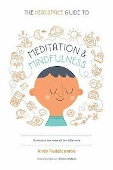

&leftarrow; [back to Book reviews](index.md)

**The Headspace Guide to Meditation & Mindfulness - by Andy Puddicombe, 2016**

## Mindfulness:
It means being present and aware during everyday life.

What is the benefit of a mindfulness?
 - life gets more comfortable
    - the more aware you are, the more comfortable you feel and the easier you relate to other
 - it helps you live more skillfully
    - being aware allows you to respond skillfully to difficult situation, be sensitivy and restrain yourself when it is beneficial 

These benefits are achieved through a fundamental shift in how you relate to your thoughts and feelings

## Meditation:
Meditation is an exercise, during which you can practice awareness. It can be though of as a training of the mind.

Meditation creates the ideal conditions for you to practice mindfulness and awareness.
 - the same way as learning how to swim is easier in a calm pool of water, than in the ocean
 - learning how to be aware is easier during meditation exercise, than during everyday life

Repeating the exercise often will help in being more present, more aware.

### Training the mind
It is not just focusing on the breath. It has there components to it, which need to be undestood:
 - The approach - what to expect of the training
 - The practice - how to practice the tecnique
 - The integration - how to integrate into everyday life

## The approach
Metaphors and useful ways to think about the mind.

Goal: being present in everyday life and experiencing the current moment

Examples of not being present:
 - attention is focused on past event
 - attention is focused on imaginary future
    - divided attantion and energy, subtle conflict in the mind
 - chasing after pleasant thoughts and feeling 
 - resisting unpleasant thoughts and feelings
    - the chasing and resisiting results in suble tension in the mind
 
 *If we can give up the desire to always experience pleasant thing, and give up the fear of experiencing unpleasant things - then we can have a quiet mind*

How to thinkg about hapiness/sadness:
  - happyness comes and goes
  - the same way as sadness comes and goes
  - you can't have happyness wihtout sadness, it's a package, it's part of being human
  - when you feel sadness, where do you fell it? 
      - in your chest? in your ear? in your toes?
      - what size and shape does sadness has?
      - try to inspect it with curiosity, replacing thoughts with simple awareness
      - try to focus on others happiness, instead of yours
  - there is another kind of happyness, which is comfortable no matter the emotions, the happyness of a quiet mind

### Wondering mind

Metaphore 1: Think of the mind as a busy road, and think of thoughts as cars
  - just as roads are build for cars to travel on
  - our mind was built to experience thoughts and feelings
  - many thoughts are autonomous, they just arise, we can't control our flow of thoughts
  - many times we get involved and try to control thoughts, which is like running into traffic to control cars
      - sometimes we try to stop thoughts through force
      - other time we ignore thoughs and think of something else
      - or we get involved and encourage pleasant thought
   - instead of running into traffic, we can train the mind to observe the thoughts/cars from the side of the road

Not all thinking is bad
 - the goal is to identify how much of your thinking is helpful and productive, and how much is unhelpful and unproductive

Metaphore 2: The sky is always blue
 - thing of your mind as the blues ske and think of thoughts as clouds in the sky
 - some clouds are nice and fluffy
 - some clouds are grey and scare
 - but underneath it all, the sky is always blue

There is no such thing as good or bad meditation. There is aware an unaware.

Metaphore 3: thinkg of your mind like a theater
 - there is a play unfolding, but there is no need to interfere
 - it can be fast moving, slow moving, you might get involved and entertained, or you might get bored and plan for the next day
 - but it is not your job to direct, to get involved, you just need to wath what unfolds

## The practice - Meditation Take 10 Exercise
Gentle curiosity, no judgement, just observe
 
 1. Preparation 
    - slow down before, don't rush and jump into it
    - you'll need to find the right balance between focus and relaxation without drifting off
    - so for example if you are tired lying down to do the exercies might not be a good idea
 2. Checking in 
   - bringing your body and mind together, necessary part of meditation. Should take around 5 minutes.
   - start with eyes open, deep breath, and notie how your body extends and relaxes
   - close your eyes and be more aware of physical sensations, like the weight of your body, the contact points with the surface, sounds around you
   - allow thought to come and go, and observe the general your general mood and your energy level
   - check how the body feels, scan for tense/relaxed and comfortable/uncomfortable areas
 3. Focus on the breath
   - observe rising and falling sensations
   - the breath can move around in the body - stomach/lungs
   - observer the rythm, depth, tighness/spaciousness, roughenss/smoothes
   - in case you notice yourself being distracted, your mind wondered off, just acknowledge this and return to observing the breath
   - if it helps you focuse, count the breaths up to 10 and then start over
 4. Finish off 
   - free the mind, let if be as busy or as quiet as it wants to be
   - bring back the attention to physical sensations, contact, sounds
   - open your eyes, notice how you feel
   - carry awareness to your next activity
 
## The integration
  - if you are not aware, thoughs take over control
  - meditation in itself, getting all nice and calm, what good is it for if it doesn't change the way you feel and behave in life
  - the ultimate goal is to live mindfully, so your own life and life of other around you will be more comfortable, and to maintain awareness to respond skillfully to situations

Notice mental habits
 - cought up in thoughts - not aware
 - communicate skillfully and sensitively
 - notice resitance and inpatience

How much effor you put into things?
  - too much effor can be unproductive
  - balance between focus and relaxation
  - learn how to work with the mind every day

### Relating to others
By knowing your mind, you understand others as well, and the fact that we all share the human condition.

The journey from self to other is as follows:
 - a calm mind - leads to clarity - to contentment - and to compassion
 - a busy mind - leads to confusion - with no space left for others

Practice gratitude and kidness towards yourself and others
