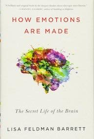

&leftarrow; [back to Book reviews](index.md)

**How Emotions Are Made - by Lisa Feldman Barrett, 2016**

## Main message of the book:
 - the *classical theory of emotions* does not stand up to evidence anymore
 - a new theory of *constructed emotions* is a better fit to the scientific evidence
    - and also provides useful tools to think about emotions and improve our lifes

## Classical Theory of Emotions
  - states that emotions are localized to individual parts of the brain (e.g.the fear circuit/network) - one-to-one mapping
    - however a metastudy found no consistent emotional fingerprints in the brain - no dedicated circuit
    - each instance of an emotion can vary a lot, using different brain parts
  - states that emotions are the reactions of the brain to a certain situation
    - reactive brain would be metabolically less efficient than a predicting/correcting brain    
    
## Categories
  - classical category - prototype, traits
      - a bird - has feather and wings and can fly - almost every instance fits the description, all physically similar
  - funcitonal category - abstract, goal based
      - things that protect you from the rain - umbrella, roof, a dont-care attitude
      - instances can be vastly different physically, but they are united by the abstract concept of serving the same funcionality/goal
      - these categories are human constructed
          - we impose meaning on the phyisical objects
          - and have a common agreement on it
      

## Constructed Emotions Theory
  - an emotion - is a funcional category - it is a collection of diverse instances
      - mental events (such as fear) are not created by only one set of neurons, instead combinations of different neurons can create an instance of fear
      - multipurpose neurons - in contrast with the classical view, there is no brain area dedicated to an emotion
  - the brain is constanly predicting - anticipating the best guess of what's going on - and how to kepp you alive and well
      - the brain uses concepts (past experience) to make sense of internal/external stimuli
  - an emotion - is the brains creation of what your bodyly sensations mean, in relation to whas going on around you
      
      
      
      
      
      
      
      
