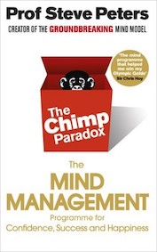
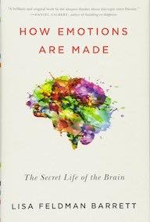
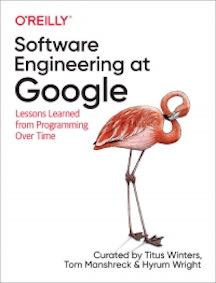
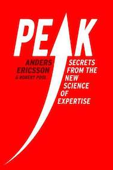

&leftarrow; [back to Homepage](../index.md)

**[The Chimp Paradox - by Prof Steve Peters, 2012](chimp_paradox.md)**

**[Being Nobody, Going Nowhere - by Ayya Khema, 2005](beingnobody.md)**

**[How Emotions Are Made - by Lisa Feldman Barrett, 2016](how_emotions_are_made.md)**

**[Software Engineering at Google - by Titus Winters, Hyrum Wright, 2020](software_eng_at_google.md)**

**[Peak - by Anders Ericsson, Robert Pool, 2016](peak.md)**

**[The Universe And The Teacup - by K.C Cole, 1998](the_universe_and_the_teacup.md)**

**[The Willpower Instinct - by Kelly McGonigal, 2013](the_willpower_instinct.md)**

**[Villanások (Bursts) - by Barabási Albert László, 2010](villanasok.md)**

