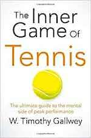

&leftarrow; [back to Book reviews](index.md)

**The Inner Game of Tennis - by W. Timothy Gallwey, 1974**

### The main takeaways of the book:

Every game is composed of two parts:

    the outer game played against external opponents, facing external obstacle, reaching external goals
    the inner game, takes place in the mind played against internal obstacles (distraction/lapse of concentration, self-doubt, self-condemnation/judgments, nervousness) - habits of the mind that inhibit excellence

To explain mental processes, let's imagine that each person has two selfe:

    Self1 - the teller, the ego-mind, expresses itself verbally - tries to hard, tries to control, is judgemental, always looking for approval and avoiding  disapproval
    Self2 - the doer, expresses itself through body movements, has a great abilities, very good instincts and natural learning capabilities (the human brain and body is a remarkable instrument)

Quieting Self1 - Letting go of judgements

    judgement is labeling things/actions as "bad"/"good", this leads to ego reactions/emotional reactions (Self 1) - anger, frustration, discouragement, tightness - which then interferes with concentration and the natural ability of a player (Self 2)
    letting go of judgement does not mean ignoring errors, just means seeing events as they are, not adding labels to them
    even positive labeling/judgement results in ego-interference, compliments can be seen by the ego-mind as potential criticisms to avoid. Once the standard for "good" and "bad" has been established, even if some event/action was labelled good, it creates an expectation on Self1 to repeat/keep up the same performance or else it will be disliked.

Communication with Self2

    change the relationship between Self1 and Self2, instead of using the critical tone of Self1 looking down on Self 2, try using a humble admiration towards the natural intelligence and capabilities of Self 2
    the native tongue of Self2 is not words, but sensory imagery: visual image and feelings ("feelmages")
    Observe other players executing strokes, try imagining what does it look and feel like to copy their movements
    Picture the desired outcome: shift attention from means to ends, where do you want the ball to end up, and trust Self 2 - let it happen

Technical Instruction for Tennis

    instructions always originate in a certain experience and feeling of an exceptional athlete, and then words are used to try to communicate those feelings to others, experience precedes technical knowledge
    words cannot exactly represent these feelings, and so we should always remember to take these instruction only as a guidance to experimenting and finding our own way

Changing habits

    habits - characteristic patterns of acting an thinking - exist because they serve a function
    it is not helpful to condemn a current habit as "bad", it's helpful to identify the function it serves and look for an alternative behavior to serve the same function
    it's difficult to become aware of a function a habit serves, while we are in the process of blaming ourselves

Ways of learning:

    the usual way
        criticize or judge behavior
        tell yourself to change, instructing with words
        try hard to do it right
        critical judgment of results -> leading to Self1 vicious cycle
    the inner game way
        observe behavior non-judgmentally (awareness)
        picture desired outcome
        trust Self2, let it happen
        non-judgemental calm observation of results -> leading to continuous observation and learning

Focus & Concentration

    the mind is restless, disturbed
    to achieve top performance - clear the mind, stop thinking
        this does not mean being stupid, it means quieting the endless jabbering of thoughts so your body can instinctively do what it's been training for
    the thinking mind (Self 1) gets in the way
    how can we learn to be in the present? practice. bringing back attention
        focus on seams of the tennis ball
        sounds of ball impact with floor/racket
        on breath in between plays to not loose focus

Inner Game outside of tennis

Playing the inner game, focusing on it makes more sense

Almost every human activity involves both inner and outer games.

    outer game - played against external obstacles/challenges - opponents, lack of skill/experience
        specific to the activity, differ in every activity
    inner game - played against internal obstacles - mental, emotional
        generic, always the same, no matter the activity
        focus, non-judgment, welcoming obstacles/challenges - are a remedy to distraction, worry aoubt future & self-image, regretting past mistakes, useful for all aspects of life
        makes more sense to train these - they are widely applicable

Prioritize Internal needs vs External demands - to be in sync with yourself
External pressures - Demands put on us by other, by society

    sometimes so deeply ingrained we don't even think about questioning them
    or so authoritative that we are afraid to question them

vs Internal desires and needs

    listening to yourself, Self 2, and acting in sync with inner desires

Stress comes from attachment, wanting - and inability to change, to let-go and accept that we will still be all right.

Self-1 trap of self-improvement:

    i am bad, I need to improve, i am behind, I need work extra to catch-up
    accepting the self critique and trying to compensate for it - is neither enjoyable nor rewarding
    you are good enough, you are good, accepting yourself - and look at improvement as an extra activity not something you need to do in order fix yourself
    abandoning the ego, stop caring about what other people think

Value of people in society attached to achievements/skills/usefuleness/looks/smarts????

