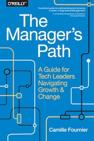

&leftarrow; [back to Book reviews](index.md)

**The Manager's Path - by Camille Fournier, 2017**

### What is the book about
The book gives advice about management on different levels, with increasing scope, based on the experiences of the author's career:
- Self Managment
- Managing People
- Managing Teams
- Managing Organizations

### The main takeaways:
- to manage others well, you have to manage yourself well first
- 1st rule of managment: no surprises (especially negative ones) communicate often & early
- the true failure of a manager is - when the teams hiding information (because they are afraid of surfacing "bad news")
- if little meaningful feedback for improvement can be given -> employee is ready for promotion / or to be given more challenging work
- the 4 basic disfunctions of teams

---

### Self Management

- to manage others well, you have to manage yourself well first
- the more you understand yourself, the better off you will be
  - the way you react (self awareness)
  - things that insipre you
  - things that drive you crazy
- get good at working through conflict
  - take ego out, learn to recognize the voice of your ego
  - see past you own interpretations, you own stories  
  - get curious

### Managing People

It's an Emotional Labor - soft skills to address the emotional need of others
- Patience
- Emphaty
- Human Connections
- Mentoring - useful both ways (the mentor pratices communicaiton skills and listening)

**Rule of management: No surprises!** 
- especially negative ones
- communicate often, early & keep records
- rule of 3, communicate multiple times, multiple ways, prepare FAQ

1-on-1:
- get to know people
  - what gets them excited/motivated
  - what frustrates them
- goals - in life/in career
- communication stlye / expectations - meeting frequency | info sharing | review frequency
- prase/feedback - give it quick
- keep a common shared doc - with topics/notes/todos/follow-ups/feedback
- driven by employee
- what's going well/what can be improved
- workplace problems
 - deal with it or put it aside for now, by agreement
 - complaining just increases drama
- deep dives
- how to measure sucess & progress? - requires goals & plans

Micro-Management vs Autonomy
- lack of trust
- trying to control outcome to meet your standards
- stripping talented/creative people of autonomy - decreases motivation

**The true failure of a manager is when the team is - HIDING INFORMATION**
- getting stuck or making mistakes - is just an opportunities for learning

Holding managers accountable:
- unstable product roadmap
- full time firefighting mode
- derailed in refactoring project

Good Manager == Good Debugger (chasing the why?s)

Tech lead qualities:
- good communcation & listening - reporting
- good prio skills - planning, break-down
- pick up the pieces - make it happen, keep the project moving
- understand the architecture
- don't do only interesting/boring things

Tech lead principles:
- Influence without authority
- API first design
- Critical vs Optimal identification
- The value of planning is to force forethought and deep thinking (not to come up with the perfect plan)

#### Continous Feedback and Performance Evaluations

- pay attention in every sprint, and highlight
  - talents & achievements
  - improvement areas - and only focus on main thing
- be specific (examples) - fight against bias  
- common themes for improvement areas
  - struggle saying no (distracted, not focusing on prio)
  - hard for others to work with (rude, overly critical)
  - does not work well across teams, with other teams
  - struggle to break up work (balancing planning/design - with getting things done)
  - cutting corners and not following best practices 
- **if no/little meaningful feedback for improvement -> ready for promotion / or to be given more challenging work**

As a manager you need to know how to play the "promotion game", how to showcase your people for promotions.

###  Managing teams

- identify & clear bottlenecks and roadblocks - (speed & frequency of code release)
- keep team focused on top prio deliveries - clear goals, aligned
- clear communication: timeline & scope
- learn how to work with smarted/techier people
- supporting people is more important than tech skills
- but you have to remain technical - coding, stay connected - as it makes your job easier

**Debugging Teams - 4 basic disfunctions of teams:**
 - not shipping (meeting small goals)
 - people drama and negative effects on team dynamics (brilliant asshole)
 - unhappiness due to overwork
 - collaboration problem

How to drive good team decisions:
 - guide, not dictate decision
 - use data to support
 - review assumptions after project is done - that's how you learn to make better decisions
 - approach for conflicts:
   - conflict avoider - easier, but hits you back harder later
   - conflict tamer - harder, but better in the long run
 - don't always rely on consensus/voting - because not everyone has equal stakes/knowledge/bias
 - depersonalise decisions - standars/process 
 - you are free to disagree - but you have to understand why, get curious
  - where are other opinions coming from (cannot just assume ignorace/stupidity)
  - seek out more info to be in the best position to decide

Disrespecting manager/team members:
- ask why are they working here, do they want to keep working here?
- Y: there are rules/standards to follow - if they want to keep working here
- N: start process to move team/leave company

As an IC (Individual Contributor) you get quick wins, short feedback loops:
- test pass
- new feature shipped
- bug fixed

As a Manager you get no quick wins, long feedback loops:
- set goals
- clarify requirements
- follow-up on task completion

### Management tasks - 4 general categories
- Info gathering/sharing
- Nudging - reminders, keep on track, asking questions (instead of ordering)
- Decision Making - managing conflicting perspectives and even with incomplete information
- Role Modeling - values

### Project Management

Rules of thumb:
- Q1 more productive than Q4
- ~10 weeks per engineer/per quarter for focused work
- doubling rule - when doing estimations
- 20% of capacity on sustainability (tech debt, refactor, sustainable engineering)

Managing time:
- importance vs urgency
- efficient meeting - agenda / up-front work-reading / summary-conclusion documented

Effective strategy for saying NO:
- yes, and for that we only have to delay the other project
- help me say yes - asking details about ideas
- yes, but not right now - appeal to budget/time

Main goals:
- team is aligned, shared vision
- team works effectively
- all-in-all: less wasted time, not faster delivery then the estimated work

Strategies
- break down the complex end goal into smaller pieces (milestones)
- prioritize, set order tasks should be done in
- risk & uncertainty - leads to slow downs and fail
- push throught the details unknowns
- adjust the plan on the fly
- launch/rollback plan

### Culture

A complex system that works, always evolves from a simple system that works - never created from scratch
- shared rules of a community, core principles, guidelines to follow
- creates automatic rules of interaction/decision making
- makes collaboration easier, aligned
- not exactly the same for every person, but big overlap - the bigger the overlap, the easier the collaboration

Create space/framework for casual interactions:
- dreaded interactions - if you only have interactions with someone when you need something or something went wrong

### Engineering Processes

Engineering procees == risk management ~ a proxy for how hard it needs to be for something complicated (rare/risky) to happen 
- no engineering process == you can't scale
- wrong engineering process == you slow down teams

Focus:
- product/business focused company -> promotes leaders who are the best shippers, best communicators across functions
- engineering focused company -> promotes leader who are the most skilled, up-to-date in technology

Code Review:
- do not debate style - unproductive - use linter
- limit pending MRs (don't overwhelm) 

Post Mortems:
- instead of blaming, learning opportunity
- blaming leads to hiding information, nr1 management failures
- mistake of the month - socialize that it's okey to fail, if we learn from it

Architectural review:
- preparing for the review forces deep thinking - whys? risks?
- unrealistic to review everything

### CTO
- not a techincal role, tech people would not enjoy it
- instead it's a strategist role, to expand the company - guessing about the future

Delivering bad news:
- in person (if possible)
- individually (instead ot all at once)
- clear & honest
- show that you care about team/project
- why is this the path forward?
- what are new opportunities?

Asking for advice
- shows respect and it's a covert way to surface problems

