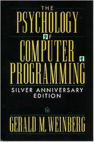

&leftarrow; [back to Book reviews](index.md)

**[The Psychology of Computer Programming - by Gerald Weinberg, 1971](psychology_programming.md)**

### The main problem discussed in the book:
 So the question what makes a good program or even what makes a good programmer cannot be answered universally. It's a more complex issue.

 
### What makes a good program? 
- Programs cannot be judged in vacuum
  - There is always a context (particular computing environment, language and technology, team, working environment)
  
These 4 factors that affect good programming:
- **meeting the specifications**: any program that works is better than any that doesn't
- **making the schedule**: a good program is the one which gets done on schedule (late can be worthless, or very costly), people are more sensitive to variability, than absolute length of estimations
- **adaptability**: a good program is easy to read and adapt (programs read more than written, and need modifications during their lifetime)
- **efficiency**: trade-off in one area can mean inefficient in another. Specs can often be relaxed in some areas. Apart from program time, there is people time to consider.

### What makes a good programmer? 

- Good programmers are introspective
  - In case they did something wrong they examine the mental process that led to the problem, and do something to change it
- Programming is a team sport
  - most times programming is done in a team as part of a social unit
- A smart programmer uses his intelligence to modify his social behavior and methods of communication to adapt to any team

**Egoless programming**: 
- finding and exposing errors is a good thing and should not be taken as personal attack
- the common goal is to improve the software.

Egoless programming results in:
- increased chance of detecting erros, higher quality software
- increased readability, programs organized in a clear and understandable way, written with the other person/reviewers in mind (like teaching is to learning)

### What makes a good manager?

- Managers who pay attention to people get good results
  - people are not code modules, where you input a task, and expect work as output, with no observation, no interaction necessary 
- Team goals: achieve true consensus, by having the team set its goals for itself
  - participating ensures goals are clearly understood and enhance goal acceptance
- Only the leader who is ready to step down has a real chance of success
- Resist accepting goals your team cannot meet

Many programming projects are late, because not all objectives are clearly communicated (work for speed or efficiency). But the danger is that communicating objectives can change estimates: if a goal is set explicitly it has two effects:
- programmers work towards that goal at the expense of another goal
- they will be far more conservative/accurate/cautious estimating how well they will meet that goal
In contrast estimations on goal not emphasized/communicated will be unreliable, because they are not made carefully and these goals are not important enough to resist being sacrificed for other goals.
Parkinson's law: work fills the time allotted. this could be because of the existence of other goals whose importance relative to the schedule is not made clear.

Personality is more important than intelligence in programming, as we are more likely to make a personality mistake in hiring than an intelligence mistake.
personality, work habits, training matter more than intelligence, and these things can be changed. so focus should be on creating great programmers, not on selecting them
each individual has a unique problem solving style, so the great challenge is communicating thoughts in a way that other people -each with a unique style-can understand (creative communication)
humility is a crucial trait. without humility a programmer is foredoomed tó the classic pattern of Greek drama: success leading to overconfidence leading to blind self-destruction. the other side of the con of humility is assertiveness, out forcing of character.

we cannot hope to measure intelligence by performance on a problem, because thera are as many non-intelligent reasons to get the "right" solution, as there are intelligent reasons for getting the "wrong" solution

certain people can do certain things better, and an intelligent person tends to look for methods of solution that depends on his best qualities and avoid his weakest, or can turn his handicap into an asset by developing shortcuts that bypass weaknesses or being more careful/testing more leading to better outcomes
different writing conditions, different programming phases (design, coding, debugging, testing, documentation/explanations) favor the application of different forms of intelligent behavior, and give different programmer a chance to shine
other factors like motivation and perseverance

Surprisingly, the only time we fail to learn is when there are negative forces set up against it. (ego in annoying there are thing to learn, fear of failure). Much emphasis is placed on motivating people to learn with all sorts of tricks. But any child left on his own learns a vast number of things, not necessarily the things we want them to learn, but vast numbers all the same. We build certain walls and doors to shape learning, but many time possibly better learning would have occured without our artificial barriers.

When faced with a problem two general errors we can make - think that the problem is harder than it really is (and afraid of starting/trying to solve it), or think that the problem is easier then it really is (and jump into solving it without extra prep, leading to failure)

Self-taught students have one major advantage over classroom students, individual attention and lessons precisely tailored to their needs.

The optimum conditions for learning, performing widely vary for each individual (time of day, body position, environment, noise, tools used) Why should an individual working alone have to make compromises whatsoever with these conditions? - schools/office work

Documentation - what is the goal, for whom is it for?
what is the depth? what knowledge is expected of the reader?
cannot satisfy all readers equally, but the goal is to do reasonable good documentation. Convince the programmer that they will benefit from writing documentation (easier to remember, to explain, to reason about errors, new feature, modifications, to answer to requests and questions)
there is not much point having easier acces to information you didn't want in the first place

And what if we become better, more productive programmers, what work shall we turn our talents to?
For if something is not worth doing, it is certainly not worth doing right. Is what your doing with computers worth doing? 
