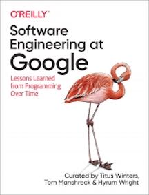

&leftarrow; [back to Book reviews](index.md)

**Software Engineering at Google - by Titus Winters, Hyrum Wright, 2020**

## The main ideas presented by the book:
- Software engineering vs Progamming
- Software engineering is programming integrated over time
- The book presents all the things you should consider for your project, if they are planned to have a longer lifecycle
- Large emphasis on continous delivery: 
  - on a longer timespan your software must be able to react to changes, the incapability to react is a high-risk bet, because changes are inevitable (technologies - dependencies, runtimes, hardware; business - market conditions, customer taste)
  - ability to make reliabe updates - is the essence of long-term sustainability for your project

## Culture

Policies need to scale - sublinear human work/intervantions needed

Distribuite/Scale knowledge
 - psychological safety - it's okay to not know something, it's okay to ask questions, it's okay to be wrong/to fail - we all learn constantly, no one is perfect
 - don't reform/remove/rewrite system without understanding the context 
    - "Chesterson’s fence" - if you don't understand why a fence was erected in the first place, removing it might cause unintended consequences
    - unless you know why someone made a decision, you can’t safely change it or conclude that they were wrong
    - great decisiones depend on understanding the rational behind previous descisions
    - second order thinking - consequences of the consequences of your decision
 - document it vs one-on-one explanation
 - "leave the camping grounds cleaner than you found it" - README.md updates

### Leadership

Don'ts
- don't micromanage or treat like children - trust them to do the right thing
- don't ignore low performers - ruin teams/it's not beneficial for them either - set up micro goals
- don't hire pusharounds, low performer - hire smart/ambitious
- don't be everyones friend - but be humble and respectful

Dos
- do set clear goals - and clear priorities (aligns teams, make them more efficient)
  - define vision/goals - what things need to get done - and trust the team to figure out how
- do lose the ego - encourage inguiry, seek constructive feedback apologize, aknowledge your mistakes,
    - take the job seriously, but don't take yourself seriously
- do ask questions - when someone ask for advice, they typically want you to help them solve a problem, by refining and exploring the problem
- do build consensus - drive the process, gentle push if needed
- do be honest - i'm not allowed to tell you, I want you to know that you are doing something wrong, but I'm commited to helping you improve
- do track hapiness - make sure they get recognition, shitty tasks are spread evenly, no one works long hours

Always be deciding

"Important and ambiguous problems do not have magic “silver bullet” solutions. There’s no answer that works forever in all situations. There is only the best answer for the moment (this month, reevaluate next month), and it almost certainly involves making trade-offs in one direction or another. It’s your job to call out the trade-offs, and help decide how to balance"

"The trap of searching for the perfect solution, which leads analysis paralysis. - You need to make your teams comfortable with iteration - you need to frame your process as continuous rebalancing of trade-offs, it’s an iterative process. This is what we mean when we say Always Be Deciding."

“if you try to achieve an impossible goal, there’s a good chance you’ll fail, but if you fail trying to achieve the impossible, you’ll most likely accomplish far more than you would have accomplished had you merely attempted something you knew you could complete.”

“Hope is not a strategy.”

### Research advice
 - what results are you expecitng and why? - fight bias, ad-hoc explanations of results
 - if data supports your expected results, what action will be taken? - if no action/no point of measuring
 - if we get a negative resutls, will appropiate action be taken? - if negative results don't change a deicision (there are other factors/inputs), it might not be worth measuring
 - who is going to take action on the resutls and when? - what kind of evidence is expected and what is the time frame

GSM system
 - Goal - what you want to understand 
 - Signal - how you might know, signals that you'd like to measure (they might not be measurable)
 - Metric - a proxy for a signal, which we can measure

## Process

Optimize (code) for the reader 
  - will be read many more times, than written - preference of simple to read over simple to write
  - evidence for intended behavior
  
Document reasoning behind a decision 
  - as time passes the reasoning could not make sense any more and might need to be reevaluated 
  
Simpler solutions are always preferable
  - easier to understand
  - easier to change
  - complex funcionality might never be needed - YAGNI - or not needed in the way it was implented

A code review benefit, the little moment of reflection before sending off your change, forces an engineer to resolve issues before sending the change and not cut corners

Documentation
  - extra burden to maintain vs something that will make the maintenance of existing code easier
  - writing documentation leads to better design - if you can't explain it you probably haven't designed it well enough

### Testing
Test maintainability - (usefulness)
  - test pulic api/exported methods (user perspective), not private/inner methods/helper methods
  - test state, not interactions/implementation
  - test name = tested behavior
    - clear given/when/then [when[and]/then[and]]
    - clear expected vs actual
    
Prefer Real implementation instead of test doubles (real > fakes > mocks)
  - tests real code, catches more bugs
  - tests do not need separate update when implementation changes
  - unless there are concers of
    - speed
    - determinism - flakiness
    - dependencies - lots of dependencies, hard to construct

Test doubles - Fakes
  - lightweight implementation of an API - behaves the same as the real object
    - can be hard to create
    - can be hard to maintain - update when real behavior changes - (testing the fakes) 
    - appropiate fidelity level
  
Test doubles - Mocks - stubbing & interaction testing
  - stubbing - (mocks) giving a behavior to a function with no behavior - when().then() - mocking frameworks
  - interaction testing - (mocks) how a function is called - verify() - mocking frameworks
    - leaks implementation details into tests
    - no way to ensure fidelity
    - should be only used to stub minimum amout of functions, and only those that releate to the test assertion

**Hyrum's Law** - with enough users, all observable behavior will be depended on (not just your API contract)

Deprecation
  - code is a liability, and the funcionality it provides is an asset
  - plan for deprecation
    - design successor systems with a migration path from older systems in mind
    - can parts can be easily replaced? can clients easily migrate?

### Tools

Source Control - not only technology + but policies and usage conventions
  - branch management
    - dev branch - lots of overhead
      - postponing the quality check
      - merging large branches (multiple changes) - makes failures difficult to root-cause and fix
      - when used make them short lived
    - trunk-based development
      - one repo, one branch, one source of truth
      - correlates with high-performing software orgs

Build system: Flexibility vs Determinism->Parellelism
  Task-based build systems
    - define tasks and dependencies between tasks
    - imperative buildfiles, arbitrary tasks 
      - felxible, more control for the developer, but non deterministic build systeem cannot track/paralellize steps
  Artifact-based build systems
    - define only targets to build, the build execution steps taken are left up to the build system
    - declarative buildfiles, limited number of tasks
     - less control for the developer, but build system can track/parallelize
     
Dependency managemant - hardest problem in software
 - not just single dependency, but networks of dependencies
 - diamond dependency problem, how to find mutually compatible versions in these networks
 - getting something to work -vs- maintenance, it is working in a supported fashion - dep changes over time
 - difficult to say: “No, you can’t use this thing that solves your development problem perfectly because we don’t have resources to update everyone with new versions constantly”

Semantic Versioning
  - Minimum Version Selection = versions as close as possible to the ones the author used, smaller steps in versions

### CI/CD
Continous Integration == Alerting "left shifted" 
  - surface problems asap
  - not only testing your code, but also testing your dependencies (HTTP, RPC, messaging), ingested data, execution environment
  - which tests to run when where?
    - execute pre-commit, post-commit, in staging deployment?
    - instability, failure isolation vs coverage
  - how to compose the system under test?
    - cost - fidelity balance

Martin Fowler: “The biggest risk to any software effort is that you end up building something that isn’t useful. 
  - early and frequent working software shown to real users for feedback 
  - release deadline - late feautres go on the next train

A software product is never ready - it can under improvement or abandoned
“You get extraordinary outcomes by realizing that the launch never lands but that it begins a learning cycle where you then fix the next most important thing, measure how it went, fix the next thing, etc.—and it is never complete.”

No software is perfect - and that's okay - as long as hits your set targets
  - if comprehensive testing is practically infeasible, aim for representative testing instead
  - core, primary funcionalities, risk mitigations tested

Set up cost is high, but the long-term wins in terms of risk management, developer velocity, and enabling rapid innovation are so high that these initial costs become worthwhile
  
Microservices - reduced operational cost and gains in cognitive simplicity

Compute-As-A-Service
 - treat machines like cattle, not pets
 - different use casese: batch vs serving
   - throughput across many machines vs individual request latency
  
API/Service design trade-off
  - finding the rigth abstraction level
  - generic API, easier to manage, coherence - vs - usage inconvinience
