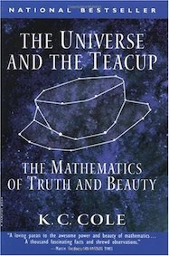

&leftarrow; [back to Book reviews](index.md)

**The Universe And The Teacup - by K.C Cole, 1998**

### Highlevel overview:
Although it is a book written 30 years ago, the ideas it presents are very much relevant in 2020. 
The chapter do not present a story, rather ideas structured around mathematics, physics and philosophy.

### Ideas that struck me the most:

Truth is weird:
 - logical truth - used in mathematics and reasoning, which should be clear and exact - except there the Godel's Incompletenes theorem
 - probabilistic truth
   - in science, falsifyable theories are proposed and then with experiment their probable truthiness increases, but we can never be absolutely sure
   - but you can be absolutely wrong, and that's easy to prove with an experiment, counter example
   - use a high standard, to accept something as truth - what is the probability that this is only a chance event?
     - upsilon particle "discovery",  1 in 50 - turned out to be a change event, "Ooops, Leon"
 - truth by consensus:
    - jury, law and order does not have time for peer reviews and long revisions, needs decisions quickly

Symmetry suggest importance:
 * symmetry means invarince, indistinguishable - and usually leads to understanding nature better
  * all water molecules are indistinguishable - this symmetry suggests something about the nature of molecules
  * sphere - invariant to all rotation, is more symmetrical than a square
 * Einstein was searching for unvarying truths, that link disperate ideas, with his theory of relativity
   * Things look relative, but don't let that fool you!
   * Light always travels at the same speed
   * Emma Noether - "saved" Einstein's theory, she proved that envergy is conserved in a four dimensional space - by proving thet conservation laws are the same as symmetry laws
   
Biological mistery:
 * symmetry braking has widereaching consequences for chemistry, molecules come in two forms - mirror images of each other
 * molecules in other words, can be left or right-handed, and this sublte difference can influence color, taste, potency
 * nonliving things, like crystals, come in left and right-handed form in roughtly equal numbers
 * however, most DNA as well proteins spiral only in one direction - to the "right". This right-handed bias is extremely surprising
   * this leads to speculations about the origin of life
    * if life came into existence at many locations at once, than those early moleculs would be equally lleft and righ handed
    * but if life originated in a single rare event, that that molecule would have passed down its right handiness as a legacy to all living things to come

Science is weird:
 * we can predict when a lunar ecplipse will occure precisly, but cannot predict that the sky will be cloudy and there is no point of going to the top of the hill to see it
 * only repeatable phenomena can be measured and predicted (in a hypotetical universe, where the laws are changing, we would not be successful in understanding the universe as we are now)
 * prediction as in foretelling the future in not the goal, nor the forte of science. Predictions are used as guideposts along the way to deeper understanding

Scale is weird:
 * pint-size objects barely feel gravity, on that scale the electrical forces that hold molecules together are stronger
  * flies have no problem walking on the ceiling, the molecular forces at their feet are stronger than gravity pulling down their puny weight
  * put your hands in suger, they stick to your hand. put your hand in sugarcubes, and the cubes don't stick
 * in large scale matters, gravity takes over, everything larger than an asteroid is roundish shape - result of gravity pulling matter together
  * "No uch thing as a teacup the diameter of Jupiter is poissible in our world" - its handle and sides would be pulled into the center

Human flaws, that we are not aware of:
* not understanding exponential scales, even though it is build into our perceptions (vision, hearing)
 * maybe it is built into our brain/thinking as well, resulting in our incapability to understand exponentials rationally?
* humans are terrible at assesing risks
 * large numbers confuse us (lotto)
 * psychological factors like fear, drama, no control - fear of flights
 * loss aversion, omission preferred - if there was a magic drug that saves 95% of sick people, but has side effect of killing 5%, we would never approve it
  * it's better/preferred to do nothing, that to do any harm

Voting systems are flawed:
* there is no perfect voting system, all systems favor some type of candidates - works of Arrow

Envy free divison of goods - Adjusted Winner strategy

Chance events have a duality:
* unpredictable on a small scale
* yet very regular and predictable on a large scale

Disorder has higher probability than order.
* things teng to go towards disorder

IQ vs Race:
* there is larger differences within a group than between groups (people living in a capital vs people living in rural areas)
* instead we should compare the IQ of people who care about racial IQ to the people who don't
